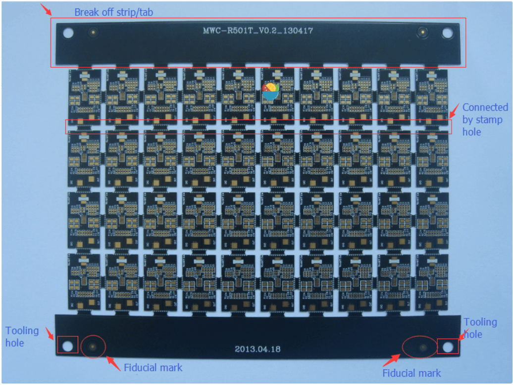

# PCB 设计入门指南  
> 本文是 [PCB Design Tutorial by David Jones](https://alternatezone.com/electronics/files/PCBDesignTutorialRevA.pdf) 的翻译版本，原作者是 David L. Jones。该文章发布于2004年，部分内容可能随着时间的推移已经不准确或过时（但是基本的PCB设计技巧应该不会这么快改变，但愿）此外，

### 翻译术语对照表（用于纠错）
+ track：走线，与 IPC 的说法保持一致
+ routing：布线，与多数 EDA 软件保持一致
+ routing tracks：铺设走线
+ thou：长度单位，千分之一英寸，不做翻译
+ mil：长度单位，千分之一英寸，不做翻译
+ PCB：印刷电路板
+ Snap Grid：捕捉网格，某商业软件习惯称之为捕捉栅格，但是本文档希望能在通俗程度上保持平衡，没有采用这种过于复杂的术语，网格显然比“栅格”易于理解。

### 简介
你已经把电路画好了，也许你甚至已经用面包板做出了一个原型（prototype），现在是时候把它编程一个漂亮的印刷电路板（Printed Circuit Board，PCB）设计了。对于一些设计师来说，PCB 设计是设计流程中自然而然的延伸，但对于许多人来说，设计和布局（Lay out） 一张 PCB 的过程可能是一项非常艰巨的任务。甚至有些非常有经验的电路设计师对PCB设计知之甚少，因此把它留给了 "专家 "————专业的 PCB 设计工程师。许多公司甚至有自己专门的PCB设计部门。这并不奇怪，考虑到将数百个元件和数千条走线（track）安置在一个复杂的（有人说是艺术性的）设计中，以满足大量的物理和电气要求，往往需要大量的知识和才能。正确的 PCB 设计往往是设计中不可或缺的一部分。在许多设计中（高速数字、低电平模拟和射频等等），PCB 布局可能决定了设计的运行和电气性能。必须记住的是，PCB 线路有电阻、电感和电容，就像你的电路那样。  

这篇文章的目的是希望能消除 PCB 设计的一些神秘感。它给出了一些建议和"经验法则"，说明如何以专业的方式设计和布局你的PCB。然而，试图 "教导 "PCB 设计是相当困难的。有许多基本规则和良好做法需要遵循，但除此之外，PCB设计是一个高度创造性和个性化的过程。这就像试图教别人如何画画一样。每个人都会有自己的独特风格，而有些人可能根本没有创造性的天赋  

事实上，许多PCB设计师喜欢把PCB布局看作是艺术品，因为它们的美丽和优雅而被人欣赏。"如果它看起来不错，它就能很好地工作。"这是一句老话。
让我们一起来看看吧...

### 旧的年代
在计算机 CAD 之前的日子里，PCB 的设计和铺设都是用透明草纸上的胶布和焊盘手工进行的。许多时间都是懒洋洋地趴在日光灯箱上，用手切割、放置、撕开和铺设走线。Bishop Graphics、Letraset，甚至是 Dalo 钢笔，这些名字都会唤起人们美好的或不那么美好的回忆。那些日子已经一去不复返了，基于计算机的 PCB 设计已经完全取代了这种方法。
在业余爱好和专业电子领域都完全取代了这种方法。基于计算机的 CAD 程序允许在电路板设计和编辑方面比传统技术具有最大的灵活性。过去需要几个小时的工作现在可以在几秒钟内完成。

### PCB 设计软件包
市场上有许多 PCB 设计软件包，其中一些是免费软件、共享软件或限制了元件数的完整版本。在澳大利亚，Protel 是事实上的工业标准软件包。专业人士使用昂贵的基于 Windows 的高端软件包，如 99SE 和 DXP。业余爱好者使用优秀的基于 DOS 的免费软件 Protel AutoTrax 程序，它曾经是澳大利亚的高端软件包的选择。令人困惑的是，现在有另一个基于 Windows 的软件包也叫 AutoTrax EDA。这与 Protel 的软件没有任何关系。本文并不侧重于任何一个软件包的使用，所以这些信息几乎可以应用于任何可用的 PCB 软件包。然而，有一个明显的例外。使用不具有原理图功能，而仅能绘制 PCB 设计功能的软件包，将会极大的限制你在专业认知上对该软件包的操作。以后描述的许多更高级的技术需要使用兼容的原理图编辑程序。这一点将在需要时加以说明。  

> 译者注：在 2022 年，如果你同时对预算和版权问题比较敏感，建议使用 KiCad (发音为 /ˈkiːˌkæd/ KEE-kad )

### 标准  
PCB设计的几乎每个方面都有工业标准。这些标准由来的电子电路互连和封装协会（Institute for Interconnecting and Packaging Electronic Circuits）控制，该协会现在被简称为IPC（www.ipc.org）。对于PCB设计、制造、测试以及你可能需要的其他任何方面，都有IPC标准。涵盖PCB设计的主要文件是IPC-2221，"印刷电路板设计通用标准"。该标准取代了过去半个世纪以来一直使用的旧IPC-D-275标准（也是军事标准275）。
当地国家对PCB设计和制造的许多方面也有自己的各种标准，但总的来说，IPC标准是全世界公认的行业标准。  

印刷电路板也被称为（有人会说，更正确的叫法是）印刷线路板（Printed Wiring Boards），或简称为印刷板（Printed Wiring Boards）。但我们将在本文中采用更常见的术语PCB。

### 原理图（schematic）
在你开始布局你的 PCB 之前，你**必须有一张完整且准确无误的原理图**。在你开始布置你的PCB之前，你必须有一个完整和准确的原理图。许多人在设计PCB时，除了脑子里的电路外，什么都没有，或者把原理图画在松散的便签纸上，没有引脚编号，也没有顺序，就直接进入了PCB设计，这还不够好。如果你没有准确的原理图，那么你的PCB很可能最终会变成一团糟，并花费你两倍的时间。

"Garbage-in, garbage-out"是一句经常使用的话，它同样适用于PCB设计。PCB设计是你的原理图的制造版本，因此，PCB设计自然会受到原始原理图的影响。如果你的原理图是整洁的、有逻辑的、布局清晰的，那么它确实会使你的PCB设计工作变得容易得多。好的做法是将信号从左边的输入流向右边的输出。正确绘制电气上的重要部分，按照设计者希望的方式布置在PCB上。比如把旁路电容放在它们要用的元件旁边。原理图上有助于布局的小注释是非常有用的。例如，"这个引脚需要一个信号地的保护走线"，这样就可以让布置电路板的人清楚地知道必须采取哪些预防措施。即使是由你来设计电路和绘制原理图，注释不仅可以在布置电路板时提醒自己，而且对审查设计的人也很有用。

你的原理图确实应该在绘制时考虑到PCB的设计。

详细阐述良好的原理图设计超出了本文的范围，因为这需要一篇完整的文章。

### 英制（Imperial）和公制（Metric）
关于PCB设计，首先要知道使用什么测量单位以及它们的常用术语。

因为它们可能非常令人困惑!

任何长期从事PCB设计的人都会告诉你，你在设计 PCB 时应始终使用英制单位（即英寸）

这不仅仅是为了怀旧（虽然这也是一个主要原因！大部分电子元件过去（现在也是）以英制引脚间距制造。因此，现在不是固执己见，拒绝使用除公制单位以外的任何单位的时候了。公制单位会使你的电路板的铺设变得更加困难和混乱。如果 如果你足够年轻，在公制时代长大，那么你最好开始学习什么是英寸以及如何转换它们。

PCB设计中的一句老话是 "你要用 thou"。在你知道什么是 "thou "之前，这有点令人困惑。thou "是1/1000英寸，被世界各地的PCB设计师和制造商普遍使用和认可。都认可。因此，开始练习用 "10 thou spacing（10 thou 的间距） "和 "25 thou grid（25 thou 的网格） "说话，你会听起来像个专家

现在你明白了什么是 "thou"，我们将用 "mil"（或 "mils"）这个术语再做一次解释。1 mil "与1thou相同，并且不能与毫米（mm）混淆，后者通常与 "mil "同音。术语 "mil"来自于 1 thou 等于 1 mil 英寸。一般来说，避免使用 "mil "而坚持使用 "thou"，当试图向那些不懂公制的 PCB 人解释 PCB 尺寸时，这样会比较容易混淆，会比较容易混淆。  

一些PCB设计者会告诉你，在任何与PCB设计有关的事情上都不要使用公制毫米。在 但在实际生活中，你必须同时使用英制英寸（inches，thous）和公制毫米（millimeter，mm）。那么，用那种单位来表示什么东西？一般来说，走线、焊盘、间距和网格使用 thou，这是大部分的 你的基本 "设计和布局 "要求。只有在"机械和制造 "类型的要求中才使用毫米 要求，如孔的尺寸和板的尺寸。

你会发现，许多PCB制造商也会遵循这些基本准则，因为当他们要求你提供制造电路板的报价细节。大多数制造商使用公制尺寸的钻头，所以指定英制尺寸的孔真的会适得其反，而且容易出现错误。

为了进一步混淆这个问题，有许多元件（新的表面贴装部件就是一个例子） 都有公制的引脚间距和尺寸。所以你经常要用公制的网格和焊盘来设计一些元件的脚印。公制网格和焊盘。许多元件的数据表也有公制尺寸，尽管其间距 是按照英制网格设计的。如果你看到一个 "奇怪 "的公制尺寸，如 1.27 毫米，你可以确定它实际上有一个漂亮的整数。非常确定它实际上有一个漂亮的整数英制等价物。在这种情况下，1.27mm 就是 50thou。  

是的，PCB设计可能会让人迷惑不解! 因此，无论你在PCB设计中要做什么，你都需要成为英制到公制转换的专家。

反之亦然。为了使你的生活更轻松，所有主要的PCB制图软件包都有一个 "热键"，用于 在英制和公制单位之间即时转换（例如Protel的 "Q"）。如果你能记住几个转换键，会对你有很大帮助 

记住几个转换键，如100thou (0.1 inch) = 2.54mm，200thou (0.2 inch) = 5.08mm等。

100thou及以上的数值通常以英寸为单位，而不是以千为单位。所以0.2英寸比200英寸更常用。

因此，0.2英寸比 200thou 更常用。

1 英寸通常也被称为1 "pitch (间距)"。所以经常听到 "0.1英寸间距 "这个短语，或者更简单的是 "0.1 pitch"，并假定是英寸单位。这通常用于元件的引脚间距。

100thou 是 PCB 设计所有方面的一个基本 "参考点"，而大量的普通元件引线 
间距是这个基本单位的倍数或分数。50 和 200thou 是最常见的。

与世界其他地区一样，IPC的标准也都是公制的，只是偶尔会提到英制单位。不过，这并没有真正改变PCB行业的现状。旧习难改，英制单位在许多实际使用领域仍然占据主导地位。

### 依照网格（Grids）工作
PCB设计的第二个主要规则，也是初学者最常错过的规则，是将电路板布置在固定的网格上。这称为"捕捉网格（Snap Grids）"，因为您的光标、元件和走线将"捕捉（Snap）"到固定的网格位置。不仅仅是任何大小的网格，而是一个相当稀疏的网格。100 thou是用于非常基本的通孔工作的标准放置网格，50 thou是一般走线工作的标准，例如在通孔焊盘之间运行走线。对于更精细的工作，您可以使用25 thou的卡扣网格甚至更低。例如，许多设计师会争论20 thou网格与25 thou网格的优点。在实践中，25 thou通常更有用，因为它允许您在50 thou间隔焊盘之间正好走一半

为什么稀疏的捕捉网格如此重要？这很重要，因为它将使您的元件保持整洁和对称;如果可以的话，在美学上令人愉悦。它不仅是为了美观 - 随着布局大小和复杂性的增长，它使走线，元件和元件块的未来编辑，拖动，移动和对齐变得更加容易。

糟糕和业余的PCB设计是可以立即识别的，因为许多走线不会完全排列在焊盘的中心。一些小的走线将被"粘合"以填补空白等。这是由于没有有效地使用捕捉网格。

良好的PCB布局实践包括从 50 这样的稀疏网格开始，如果您的设计在空间上变得"紧凑"，请使用逐渐精细的捕捉网格。在需要时降至 25 和 10，以获得更精细的布线和元件放置。这对电路板上99%的部分都适用。确保您选择的更精细的网格是标准100 thou的良好均匀划分。这意味着 50、25、20、10 或 5。不要使用其他任何东西，你会后悔的。 

一个好的 PCB 软件包将具有热键或可编程宏按键，以帮助您立即在不同的卡扣网格大小之间切换，因为您需要经常这样做。 

PCB绘图软件包（drafting package）中有两种类型的网格，其一是先前讨论的捕捉网格，以及"可见（visible）"网格。可见网格是一个可选的屏幕网格，由实线、虚线或点组成。这显示为设计背后的背景，并极大地帮助您排列元件和走线。您可以将捕捉网格和可见网格设置为不同的单位（公制或英制），这通常非常有用。许多设计师更喜欢100个可见的网格，很少与此不同。

一些程序还具有所谓的"电气（Electrical）"网格。此网格不可见，但是当光标足够接近时，它会使光标"捕获"到走线和焊盘等电气对象的中心。这对于手动布线、编辑和移动对象非常有用。 最后一种类型的网格是"元件"网格。这与对齐网格的工作原理相同，但仅用于元件移动。这允许您将元件对齐到不同的网格。确保将其设置为捕捉网格的倍数。 当您开始布置第一块板时，捕捉网格可能会感觉有点"有趣"，您的光标只能按步骤一格一格移动。与大家都熟悉的普通绘画软件不同。但它很容易习惯，您的PCB设计将更接近整洁和专业。

### 依照自顶向下的方法工作
PCB设计开始工作总是从电路板的顶部开始，通过各个层进行观察，就好像它们是透明的一样。这就是所有 PCB 软件包的工作原理。您唯一会从底部查看电路板的时间是用于制造或检查目的。这种"通过电路板"的方法意味着你将不得不习惯于将底层的文本作为镜像阅读，习惯它！

### 走线（Tracks）
走线尺寸没有推荐的标准。您使用的走线尺寸将取决于（按重要性排序）  

+ 设计的电气要求
+ 可用的布线空间和间隙
+ 个人偏好

每个设计都有一组不同的电气要求，这些要求可能因电路板上的走线而异。除基本非关键设计外，所有设计都需要混合走线尺寸。但作为一般规则，走线宽度越大越好。较大的走线具有较低的直流电阻，较低的电感，制造商可以更容易，更便宜地进行蚀刻，并且更容易检查和返工。 

走线宽度的下限将取决于PCB制造商能够达到的 "最小线宽/线距（track/space）" 分辨率。例如，制造商可能会引用 10/8 的 线宽/线距 数字。这意味着走线可以不小于 10thou宽，走线（或焊盘，或铜的任何部分）之间的间距可以不小于 8thou。这些数字几乎总是以 thou 引用，首先是走线宽度，然后是间距。 

现实中的典型数字是 10/10 和 8/8 。对于基本板，IPC标准建议将 4thou 作为下限。但是，一旦您达到 6thou 及以下走线，您就将面临严峻的问题，您应该首先咨询您的电路板制造商。走线/空间数字越低，制造商在对齐和蚀刻电路板时必须更加小心。他们会把这笔费用转嫁给你，所以确保你不会比你需要的低。作为指导，使用激光打印透明胶片和预涂覆光刻胶板等"自制"PCB制造工艺，可以轻松获得 10/10 甚至 8/8 的间距。

仅仅因为制造商可以实现一定的走线/间距，就没有理由用您的设计"突破极限"。使用尽可能宽的走线/间距，除非您的设计参数需要更小的走线/间距。
 
首先，您可能希望将 25 thou 用于信号走线，50 thou 用于电源和接地走线，10-15 thhou 用于 IC 和元件焊盘之间。一些设计师喜欢较细的信号走线的"外观"，如10或15 thou，而另一些设计师则喜欢他们所有的走线都是大而"厚重"的。良好的设计实践是保持走线尽可能宽，然后仅在需要满足间隙要求时才更改为更细的走线。  

将走线从大到小，然后再变回大被称为"颈缩（necking）"或"necking down"。当您必须在IC或元件焊盘之间移动时，通常需要这样做。这允许您拥有漂亮的大低阻抗走线，但仍然可以灵活地在狭窄点之间布线。 

在实践中，您的走线宽度将由流经它的电流，以及您愿意容忍的走线的最大温升决定。请记住，每个走线都会有一定量的电阻，因此走线将像电阻器一样散热。走线越宽，电阻越低。PCB上铜的厚度也会发挥作用，任何焊接涂层表面也会受到影响。

PCB上铜的厚度名义上以盎司每平方英尺（ounces per square foot）为单位，其中1盎司铜是最常见的。您可以订购其他厚度，如0.5盎司，2盎司和4盎司。较厚的铜层适用于高电流、高可靠性设计。 根据电流和最大温升计算出所需走线宽度的计算有点复杂。它们也可能非常不准确，因为该标准基于大约半个世纪前测量数据的一组非线性图形。这些仍然在IPC标准中复制。

在 www.ultracad.com/calc.htm 可以找到一个方便的走线宽度计算器程序，并根据IPC图形给出结果。 

根据经验，走线上10摄氏度的温升是设计中一个很好的安全限制。本文中包含了一个方便的参考表，为您提供了10°C上升时走线宽度与电流的列表。还显示了以每英寸毫欧姆为单位的直流电阻。当然，走线越宽越好，所以不要盲目地照搬表格。

<table>
    <tr>
        <td colspan=4>走线宽度参考表（10摄氏度温升）走线宽度单位为thous（mils）</td>
    </tr>
    <tr>
        <td>电流</td>
        <td>1 盎司铜厚的线宽</td>
        <td>2 盎司铜厚的线宽</td>
        <td>电阻毫欧每英寸</td>
    </tr>
    <tr>
        <td>1</td>
        <td>10</td>
        <td>5</td>
        <td>52</td>
    </tr>
    <tr>
        <td>2</td>
        <td>30</td>
        <td>15</td>
        <td>17.2</td>
    </tr>
    <tr>
        <td>3</td>
        <td>50</td>
        <td>25</td>
        <td>10.3</td>
    </tr>
    <tr>
        <td>4</td>
        <td>80</td>
        <td>40</td>
        <td>6.4</td>
    </tr>
    <tr>
        <td>5</td>
        <td>110</td>
        <td>55</td>
        <td>4.7</td>
    </tr>
    <tr>
        <td>6</td>
        <td>150</td>
        <td>75</td>
        <td>3.4</td>
    </tr>
    <tr>
        <td>7</td>
        <td>180</td>
        <td>90</td>
        <td>2.9</td>
    </tr>
    <tr>
        <td>8</td>
        <td>220</td>
        <td>110</td>
        <td>2.3</td>
    </tr>
    <tr>
        <td>9</td>
        <td>260</td>
        <td>130</td>
        <td>2.0</td>
    </tr>
    <tr>
        <td>10</td>
        <td>300</td>
        <td>150</td>
        <td>1.7</td>
    </tr>
</table>

### 焊盘（Pads）
焊盘的大小、形状和尺寸不仅取决于你所使用的元件，而且还取决于组装电路板的制造工艺，以及其他事项。有一系列的标准和理论，这将在后面解释。在这个阶段，我只想说你的 PCB 软件包应该有一套基本元件库，可以让你开始使用。对于所有的的基本元件库，你都必须修改这些基本元件以适应你的目的。随着时间的推移，你将建立起自己的元件库，以满足各种需求。

有一个重要的参数被称为焊盘/孔比率。这是焊盘尺寸与孔尺寸的比率。每个制造商都会有自己的最低规格。作为一个简单的经验法则，焊盘应至少是孔直径的1.8倍，或至少大0.5毫米。这是为了允许钻头和顶层和底层的底片（artwork）的对准公差。焊盘和孔越小，这个比例就越重要，特别是与通孔有关。

当涉及到通用元件焊盘时，有一些常用的做法。有引线的元件的焊盘如电阻、电容和二极管，应该是圆形的，直径约为 70 thou。
双列直插(DIL 或 DIP)元件，如IC，更适合使用椭圆形的焊盘(常见的是 60 thou 高，90-100 thou 宽)。芯片的第 1 个引脚应该总是一个不同的焊盘形状，通常是矩形的，并且与其他引脚的尺寸相同。

大多数表面贴装元件使用矩形焊盘，尽管表面贴装 SO 封装的 IC 应该使用椭圆形的 
焊盘。同样，1号引脚是矩形的。

其他依赖引脚编号的元件，如连接器和SIP电阻包，也应遵循 "1号引脚为矩形 "的原则。

八边形焊盘很少使用，并且应当避免去使用它

一般来说，使用圆形或椭圆形的焊盘，除非你需要使用矩形的。

### 过孔（Vias）
导线通过电路板上的一个孔，将走线从电路板的一侧连接到另一侧。除了廉价的手工制作PCB和低端的商业原型，通孔都是用电镀孔制作的，称为电镀孔（PTH）。
电镀通孔（Plating Through Hole, PTH）。电镀通孔允许你的电路板上的不同层之间进行电气连接。

通孔和焊盘之间有什么区别？实际上没有什么区别，它们都是只是电镀孔。但当涉及到PCB设计封装时，还是有区别的。焊盘和通孔是，而且应该是，不同的对待。你可以在全局范围内分别编辑它们，并做一些更高级的以后再讨论。所以不要用焊盘来代替通孔，反之亦然。

通孔中的孔通常比元件焊盘要小一些，典型的是0.5-0.7毫米。

使用通孔连接两个层通常被称为 "缝合（stitching）"，因为你实际上是将两个层电性地缝合在一起，就像在材料中来回穿针引线。在谈话中多说几遍缝合这个词，你就会觉得自己像个PCB专家了。

### 多边形（Polygons）
许多PCB封装上都有 "多边形"。多边形会自动用铜填充（或 "淹没"）一个所需的区域。，并在其他焊盘和走线周围 "流动"。它们对于铺设地平面非常有用。请注意 
确保你在放置了所有的走线和焊盘之后再放置多边形。

多边形可以是 "实心 "的铜线填充，也可以是纵横交错的铜轨 "网格铺铜（Hatched）"。实心的填充物是 
是首选的，网格铺铜基本上是过去的事情了。

### 间隙（Clearances）
电气间隙是所有电路板的一个重要要求。走线和焊盘之间的间隙太小可能导致制造过程中的微短路（Hairline Short Circuits）和其他蚀刻问题。一旦你的板子组装好了，这些问题可能会非常 一旦你的板子被组装好了，就很难发现故障。再次强调，不要 "挑战 "制造商的极限，除非你不得不这样做。你必须这样做，如果可能的话，保持高于他们推荐的最小间距。

对于基本的通孔设计来说，至少15thou是一个很好的间隙限制，10thou或8thou则用于更密集的表面贴装布局。如果你低于这个限度，最好先咨询一下你的PCB制造商。

对于PCB上的240V电源，有各种法律要求，如果你要做这种工作，你需要咨询相关标准。作为一条经验法则，240 走线和隔离信号走线之间应允许有绝对的最小8毫米（315thou）的间距。良好的设计实践表明，无论如何你都会有比这大得多的间隙。

对于非主电源电压，IPC标准有一套表格，规定了各种电压所需的间隙。这里显示了一个简化的表格。该间隙将取决于走线是在内部层还是在外部表面。由于在高海拔地区大气层变薄，它们也会随着电路板在海平面以上的运行高度而变化。在给定的间隙内，敷形涂层也能改善这些数据，这通常用于军用规格的PCB。

<table>
    <tr>
        <td colspan="4" style="text-align:center">导体的电气间隙
</td>
    </tr>
    <tr>
        <td>电压（直流或交流峰值）</td>
        <td>内层</td>
        <td>外层（海拔 3050 m 以下）</td>
        <td>外层（海拔 3050 m 以上）</td>
    </tr>
    <tr>
        <td>0-15V</td>
        <td>0.05mm</td>
        <td>0.1mm</td>
        <td>0.1mm</td>
    </tr>
    <tr>
        <td>16-30V</td>
        <td>0.05mm</td>
        <td>0.1mm</td>
        <td>0.1mm</td>
    </tr>
    <tr>
        <td>31-50V</td>
        <td>0.1mm</td>
        <td>0.6mm</td>
        <td>0.6mm</td>
    </tr>
    <tr>
        <td>51-100V</td>
        <td>0.1mm</td>
        <td>0.6mm</td>
        <td>1.5mm</td>
    </tr>
    <tr>
        <td>101-150VV</td>
        <td>0.2mm</td>
        <td>0.6mm</td>
        <td>3.2mm</td>
    </tr>
    <tr>
        <td>151-170VV</td>
        <td>0.2mm</td>
        <td>1.25mm</td>
        <td>3.2mm</td>
    </tr>
    <tr>
        <td>171-250V</td>
        <td>0.2mm</td>
        <td>1.25mm</td>
        <td>6.4mm</td>
    </tr>
    <tr>
        <td>251-300V</td>
        <td>0.2mm</td>
        <td>1.25mm</td>
        <td>12.5mm</td>
    </tr>
    <tr>
        <td>301-500V</td>
        <td>0.25mm</td>
        <td>2.5mm</td>
        <td>12.5mm</td>
    </tr>
</table>

## 元件放置及设计（Component Placement & Design）
有句老话说，“PCB设计90%是元件摆放，10%是布线。” 虽然实际数字并不重要，但元件放置是迄今为止布局电路板的最重要方面的概念肯定是正确的。好的元件摆放会使你的布局工作更容易，并提供最佳的电气性能。糟糕的元件放置会使你的布线工作变成一场噩梦，并带来糟糕的电气性能。它甚至可能使你的电路板无法生产。因此，在放置元件时，有很多事情需要考虑。
每个设计者都有自己放置元件的方法，如果你把同样的电路（不管是 如果你把同一个电路（无论多么简单）交给100个不同的有经验的设计师，你每次都会得到100种不同的PCB布局。因此，没有 
没有绝对正确的方法来放置你的元件。但是，有一些基本的规则可以帮助你缓解 布线，使你获得最佳的电气性能，并简化大型复杂的设计。
在这一点上，让你了解一下布置一块完整的电路板所需的基本步骤是个好主意。

+ 设置你的捕捉网格、可见网格和默认的走线/焊盘尺寸。
+ 将所有元件扔到板上。
+ 在可能的情况下，将你的元件划分并放置到功能 "模块（building blocks） "中。
+ 识别电路上的关键走线，并首先对其进行布线。
+ 将每个元件单独放置在电路板上，并进行布线。
+ 将已完成的元件移到电路板上的位置。
+ 将剩余的信号和电源连接在模块之间进行布线。
+ 对电路板进行一般的 "整理"。
+ 做一个设计规则检查。
+ 找人检查一下

这绝不是一个万能的检查清单，它取决于许多因素，变化很大。但它是制作专业的一流 lay-out 设计的一个很好的一般指南。

让我们更详细地了解一下上述的程序

我们已经看了网格和走线/焊盘的尺寸，这些应该是你在开始做任何事情之前首先设置的东西。没有例外!

许多人喜欢直接把所有的部件放到他们认为最理想的 在电路板上的最佳位置，一气呵成。虽然这对小电路来说是可行的，但当你有更复杂的电路，有数百个元件时，你就没有什么希望了。你有更复杂的电路，有数百个元件分布在许多功能电路块上。

为什么呢？因为很容易出现 "布线空间"，也就是铺设所有走线的空间。如果你 固定所有元件的位置，然后试图对所有元件进行布线，你就很容易把自己陷入困境。
可以这么说。另外，如果你把元件放得太满，你可能会得到一块大板子，不能有效地利用空间。不能有效地利用空间。

一个没有经验的设计者的标志是，在一块电路板上，每一个元件都被均匀地隔开，然后有 数以千计的走线和通孔纵横交错在电路板上。这可能是有效的，但它可能是丑陋和低效的，更不用说更大和更昂贵的制造。更不用说更大和更昂贵的制造成本了。·                                                                                                                                                                                                                                             

开始布局的最好方法是先把所有的元件都放到屏幕上。

如果你有一个配套的原理图软件包，那么最简单的方法是让你的PCB程序 导入你的原理图设计并自动选择所有的元件。这一点也将在后面讨论。如果 你所拥有的只是一个PCB程序，那么你就必须从库中选择每个元件，并把它们放在下面 手动放置。

在屏幕上显示出所有的元件后，你应该能很好地了解到你的元件是否能很容易地适应 在你所需要的板子的尺寸（和形状）上。如果它看起来会很紧，那么你就有的忙了，要试图保持元件间距的 "紧凑"，并尽可能有效地布线。如果看起来你有足够的空间，那么你可以在布局上更自由一些。当然，如果它 看上去你有机会把你的元件放在板子上，你就必须回到 绘图板。

现在分析你的原理图，并确定设计的哪些部分可以被分解成 "模块"。

这通常是相当明显的。例如，你的电路中有一个看起来很复杂的有源滤波器。这将是 这通常有一条输入线和一条输出线，但它会有很多元件和连接作为滤波器的一部分。滤波器的一部分。这是一个典型的 "积木式 "电路，它可以很好地将所有这些部件组合在一起。部件组合在一起。因此，你可以把所有这些部件抓起来，然后开始把它们重新排列到它们的 自己的小布局，放在电路板的一侧。不要太担心实际的块在你的电路板上的位置 板上的位置。

你还需要将你的设计中对电敏感的部分分割成更大的块。一个主要的 一个主要的例子是混合数字和模拟电路。数字和模拟是不能混合的，因此需要在物理和电气上将它们分开。需要在物理上和电气上进行分离。另一个例子是高频率和大电流的电路，它们不能与低频率和低电流的电路混合。它们不能与低频率和低电流敏感的电路混合。稍后会有更多关于这方面的内容。
一般来说，你的元件应该整齐地排好。将集成电路排在同一方向，电阻排成整齐的一列，极化电容排在同一方向，连接器排在电路板的边缘。不过，不要以牺牲电气性能差的布局或过大的电路板为代价来实现这一点。电气参数应始终优先于排列整齐的元件。

在PCB设计中，对称性是非常好的，它具有美感，而且 "看起来很好"。如果你有两个相同的积木式电路，而其中一个的布局略有不同，那么它就会像一个大拇指一样突出。

如果你明智地放置了你的元件，你90%的工作就完成了。最后的10%应该只是把这些点连接起来，可以这么说。好吧，不完全是，但良好的布局是你工作的大部分。

一旦你对元件的位置感到满意，你就可以开始对所有不同的元件独立的进行布线。完成后，通常只需将这些元件移到设计的其余部分并进行排列即可。

设计规则检查（Design Rule Check，DRC）将在后面讲到，但它是确保你的电路板在制造前正确的一个重要步骤。在制造之前是正确的。DRC基本上是检查你的走线连接是否正确，以及正确的宽度和间隙。
找人检查你的电路板可能听起来是一个过于官僚的过程，但这确实是一个重要的步骤。

无论你在PCB设计方面的经验有多丰富，总会有一些你忽略的东西。一双新的眼睛和不同的思维方式会发现你永远看不到的问题。

"网络（Net）"连接与原理图进行比较，一个网络一个网络地进行。当你完成时，在原理图上突出每一个网络。当你完成后，应该没有任何电气连接没有被突出显示。你现在可以确信你的电路板在电气上是正确的。

### 基础的布线（Basic Routing）
现在是时候说说一些基本的布线（Routing）规则了。布线也被称为 "走线（tracking）"。
布线是在电路板上铺设走线来连接元件的过程。两个或多个焊盘之间的电气连接 两个或多个焊盘之间的电气连接被称为 "网络"。

+ 网络的长度应当尽可能的短。走线总长度越长，它的电阻，电容和电感就越大。所有这些都可能是不理想的因素。
+ 走线角度应当仅为45度。避免使用直角，并且在任何情况下都不能使用大于90度的角度（锐角），这一点很重要，因为它能使你的电路板有一个专业和整洁的外观。这一点很重要，可以给你的电路板带来专业和整洁的外观。PCB封装会有一个强制 45 度移动的模式，把它用上，并且应该永远不需要把它关掉。与人们的想法相反，走线上的锐角或直角走线并不产生可测量的EMI或其他问题。避免直角的原因要简单得多--只是因为不好看，而且可能有一些制造方面的影响。
+ 忘了看起来很高级的弧形走线，它们更难、更慢地放置，没有真正的优势。坚持使用45度的增量。圆润的走线拐角属于前计算机辅助设计（CAD）时代的图样。
+ 在板子的周围进行 “蛇形” 走线，不要只是去 "点对点"。对初学者来说，点对点的走线可能看起来 对初学者来说，点对点走线可能看起来更有效，但有几个原因你不应该使用它。第一个原因是，它很 丑陋，这在PCB设计中一直是一个重要因素。第二个原因是，当你想在其他地方运行更多的走线时，它的空间效率并不高。
当你想在其他层上运行更多的走线时，它的空间效率并不高。
+ 启用你的电气网格（Electrical grid，也叫电气栅格），这有时被称为 "捕获到中心（snap to center）"或 "捕获到最近（snap to nearest）"选项。让软件为你自动找到焊盘的中心和走线的末端。当你的焊盘和走线没有排到你当前的捕捉网格时，这很好。如果你没有启用这些选项，那么你可能不得不不断减少你的捕捉网格，直到你找到一个合适的网格。这种麻烦远远超过它的价值。几乎没有理由禁用这些选项。
+ 始终把你的走线带到焊盘的中心，不要让你的走线和焊盘 "刚好接触"。有 有几个原因。第一个原因是，这样做很草率，很不专业。第二个原因是，你的程序 可能不认为走线与焊盘是在进行电气连接。适当地使用扣网和 
电网的正确使用将避免在这里出现问题。
+ 使用单一的走线，而不是多个走线端对端地粘在一起。这可能对你最终的电路板的外观没有什么影响，但是对于未来的编辑来说，这可能是一个麻烦。通常情况下，你必须将走线延长一些。在这种情况下，最好是删除旧的走线，然后放置一个新的。这可能要多花几秒钟，它是值得的。人们看了你完成的板子可能不知道，但你会知道正是这样的小细节让优秀的PCB设计师脱颖而出。
+ 确保你的走线正好穿过焊盘和元件的中心，而不是偏向一边。一边。使用正确的网格可以确保你每次都能做到这一点。如果你的走线没有穿过 准确地穿过中心，那么你就使用了错误的扣网。为什么需要这样做？它能使你的电路板更整齐、更对称，而且能给你最大的间隙。
+ 除非绝对必要，否则只在100英亩的焊盘之间采取一个走线。只有在大型和非常密集的 设计时，你才应该考虑在焊盘之间采用两条走线。焊盘之间有三条走线的情况也不是没有过。但我们在这里讨论的是严重的精细公差。
对于大电流，在层与层之间使用多个通孔。这将减少你的走线阻抗并提高可靠性。只要你需要降低走线或电源平面的阻抗，这就是一条通用规则。
+ 不要将走线 "拖 "到45度以外的角度。
+ 尽可能在焊盘之间 "缩颈"。例如，一个 10thou 的走线穿过两个 60thou 的焊盘，在走线和焊盘之间有 15thou 的间隙。
+ 如果你的电源和地面走线被认为是关键的，那么就先铺设它们。此外，使你的电源走线尽可能宽。
+ 如果可能的话，保持电源和地线相互靠近，不要让它们在电路板上的方向相反。这可以降低电源系统的环路电感，并允许有效的旁路。
+ 保持对称。从专业美学的角度来看，走线和元件放置的对称性是非常好的。
+ 不要留下任何未连接的铜填充物（也称为 "孤铜"，“铜孤岛”），将其接地或取出。

如果你正在铺设一个非电镀通孔的双面板，那么还有一些额外的事情需要注意。非电镀通孔要求你在顶层和底层都要焊接一条贯穿电路板的链接。
+ 不要在元件下面放置通孔。一旦元件被焊接到位，你将无法接触到该连接点来焊接贯通。贯通的焊点也会干扰到元件。
+ 尽量使用通孔元件脚来连接顶部走线和底部走线。这样可以最大限度地减少通孔的数量。记住，每个通孔都会给你的电路板增加两个焊点。你有的焊点越多，你的电路板就越不可靠。更不用说它需要更多的时间来组装了。

### 最后的修饰
一旦你完成了所有的布线，你的电路板还没有完成。还有一些最后一分钟的检查和 你应该做一些收尾工作。
如果你的走线很薄（<25thou），那么最好在任何 "T "字路口添加一个 "倒角" 
交接处加一个 "倒角"，从而消除任何90度角。这使得走线在物理上更加坚固，并防止任何潜在的制造蚀刻问题。但最重要的是，它好看。

+ 检查电路板上是否有任何所需的安装孔。保持安装孔与任何元件或走线的距离。为任何垫圈和螺钉留出空间。
+ 尽量减少孔的数量。额外的孔径要花钱，因为制造商不仅会根据板子上的孔数来收费，还会根据不同孔径的数量来收费。
的数量来收费。非常高速的钻头旋转下来，更换钻头，然后再旋转起来，这需要时间。
请向您的制造商查询这些费用，但您可以尽量减少孔的数量，这不会有错。尽量减少孔的大小。
+ 仔细检查你所有部件上的孔的尺寸是否正确。没有什么比从制造商那里得到你的 没有什么比从制造商那里拿回布局完美的电路板，却发现某个元件无法装入孔中更令人恼火的了。
这是一个非常常见的问题，不要被发现。
确保所有的通孔都是相同的，有相同的焊盘和孔的尺寸。记住你的焊盘与孔 
比例。这里的错误会导致通孔焊盘的 "断裂"，如果孔稍微移动，就会在焊盘外面 在你的焊盘之外。对于电镀通孔来说，这并不总是致命的，但如果没有一个完整的环形环 但如果你的孔周围没有一个完整的环形圈，你的通孔在机械上将是不可靠的。
检查你的所有部件之间是否有足够的物理距离。请注意 暴露在外面的金属部件可能会与其他部件发生电接触，或者暴露在外面的走线和焊盘。走线和焊盘。
+ 将你的显示器改为 "草稿 "模式，这将使你的所有走线和焊盘显示为轮廓。这将使您能够看到您的电路板的 "全貌"，并将显示出任何被粘在上面或没有结束在焊盘中心的走线。
如果你愿意，在你的所有焊盘和通孔上添加 "泪滴"。泪滴是对走线和焊盘之间的交界处的一种很好的 "平滑处理"，毫不奇怪，它的形状就像一个泪滴。这使走线和焊盘的接口更加坚固可靠，比标准走线和焊盘之间的几乎直角更好。不过，不要手动添加泪滴，这是在浪费时间。但如果你的程序支持自动放置泪滴，请随意使用。

### 单面设计
单面设计可以大大降低你的电路板的成本。如果你能把你的设计放在一个单面板上 那么最好是这样做。看看今天的许多消费品，如电视和DVD播放器，你几乎肯定会发现一些单面电路板。你几乎肯定会发现一些单面板。它们仍然被使用，因为它们的制造成本很低。

然而，单面设计需要一些独特的技术，而这些技术在你进行双面和多层设计时是不需要的。它当然比双面布局更具挑战性。事实上，一个单面的板设计将被视为与使用的跳线数量成反比。没有跳线就能赢得了许多同行的敬佩!

这都是关于电路板尺寸和所需跳线数量之间的平衡。几乎每块单面板都需要一些跳线链接，所以尽量减少这些链接是很重要的。

元器件的摆放在单面板上更为关键，所以现在没有时间让你所有的 元器件整齐地排列在一起。安排好你的元件，使它们能够提供最短和最有效的走线的可能。这就像下棋一样，如果你不提前考虑很多步，那么你很快就会让自己陷入困境。很快就会陷入困境。如果只有一条走线从线路板的一边跑到另一边，会毁掉你的 整个布局，因为它使任何其他垂直的走线都无法布线。

许多人将他们的电路板当作双面板来布线，但只在顶层设置直线走线。然后，当电路板要被生产时，顶层的走线就被替换成跳线。这可能是一种相当低效的单面设计方法，不建议使用。你必须在你的位置上节俭，如果你看到了更好的方法，不要害怕撕掉所有的东西并重新尝试。

随着经验的积累，你将能够在开始之前就知道一个设计是否值得在单面板上进行布线。

### 双面设计
双面设计为设计你的板子提供了一个额外的自由度。在单面板上几乎不可能实现的事情，在你增加了一层后就变得相对容易了。

许多（没有经验的）设计师在铺设双面板时往往会偷懒。他们认为元件的摆放并不重要，先把通孔数加到大几百，然后问题就解决了。

他们通常会将集成电路等元件整齐地排成一排，然后用直角规则对所有元件进行布线。这意味着他们会将底层的所有走线朝一个方向布线，然后将顶层的所有走线垂直于底层。理论上说，如果你在各层之间切换的次数足够多，你几乎可以用 "阶梯 "式的模式来布线 任何东西。这种技术可能很难看，而且效率很低，是对旧的手动磁带时代的一种回溯。许多基本的自动布线器都以这种方式工作。

坚持使用良好的元件放置技术和有效的模块（Building Block）布线。

双面设计也可以让你有机会利用良好的地平面技术，这是高频设计所需要的。这将在后面讨论。

## 其他层 
### 丝印（Silkscreen）
“丝印（silkscreen）”层同时也被称为“元件轮廓（component overlay）”或者“元件层（component layer）”它是电路板顶部的一层（如果需要的话，也可以是底部），包含你的元件轮廓、代号（C1、R1等）和自定义的文本。
这是用丝网印刷工艺（silkscreening process）添加到电路板上的。标准的颜色是白色，但如果有需要也可以是别的颜色。你甚至可以在一块板子上混合和匹配颜色，但这就得加钱了。

当设计你的电路板时，请确保你的所有元件编号保持相同的文字大小和 在同一方向上。
当你布置自己的元件脚印时，如果可能的话，确保你添加一个丝印层以反映你的组件的实际尺寸。这样，你就可以一目了然地知道你可以在多大程度上 
物理定位你的元件。确保所有的有极性的元件都有标记，并且针脚1也有标识。
识别。

你的丝印层将是你所有层中最不准确的对齐方式，所以不要依赖它来获得任何位置上的准确性。确保丝印的任何部分都不与裸焊盘重叠。组件覆盖层上的线条没有最小宽度要求，所以可以随意使用较小的线条和文字尺寸来适应。如果部分文字或线条在你的电路板上不完美，那么它不会影响你的设计，这与引线和焊盘不同。
一般来说，不要把元件的数值放在丝印上，只写上元件的编号。

### 阻焊（Solder Mask）
阻焊层是电路板上的一层薄薄的聚合物涂层，它围绕着你的焊盘，帮助防止焊料在引脚之间搭桥。这对表面贴装和细间距设备来说是至关重要的。阻焊层通常覆盖除焊盘和通孔以外的一切。你的PCB程序会自动去除焊盘和通孔的阻焊层。它在焊盘和阻焊层之间留下的间隙被称为 "阻焊外扩"。阻焊外扩通常应设置为至少几 thou。注意不要让它太大，否则在非常细小的间距器件之间可能没有阻焊。
你的阻焊在你的PCB软件包中显示为阴性图像，就像你的电源平面一样。在 正常情况下，你不需要在阻焊层上放任何东西。但是，如果你想在电路板的某个部分不放 你可以在阻焊层上放置走线和填充物。这通常是 从电路板的顶部移除一小块阻焊层是很方便的，因为那里的下方没有走线。这就为你的电路板留下了一个很好的裸露可见的部分，可以用笔写些东西。
阻焊层有两种类型：丝网印刷（silkscreen）或 "液态感光阻焊（ photo imageable）"。可拍照的掩模提供了更好的分辨率和排列方式，比丝印的要好。你可以得到不同颜色的阻焊，但标准颜色是绿色。
在大多数标准质量的电路板上，阻焊层直接铺设在裸铜走线上。这被称为裸铜覆阻焊膜（SMOBC）工艺。除了阻焊层之外，你还可以在你的走线上获得其他涂层，但这些通常是针对相当特殊的应用。
如果你愿意，你可以用阻焊层覆盖通孔，这被称为 "过孔盖油（tenting ）"。这对紧密公差设计很有用，可以防止焊料流入通孔。

### 机械层（Mechanical Layer）
机械层（根据不同的封装可能有其他名称）用于为您的电路板提供一个轮廓和其他制造说明。它不是你实际的PCB设计的一部分，但对于告诉PCB制造商你希望你的板子如何组装是非常有用的。这一层没有硬性规定，你想怎么用就怎么用，只是要你跟PCB制造商说了就行

### 禁止布线层（Keepout）
禁止布线层通常定义了你的电路板上你不希望自动或手动布线的区域。例如，这可能包括安装孔焊盘或高压元件周围的间隙区域。

### 层对齐（Layer Alignment）
当PCB制造商制作你的电路板时，每一层的光绘底片（artwork film）上都会有对位公差。这包括走线、平面、丝印、阻焊层和钻孔。如果你在设计中没有考虑到这一点，把公差做得太小，你会有大麻烦。请咨询制造商，他们能达到什么样的对位公差，也请咨询你即将付款的是多大的对位公差!

### 网表（Netlists）
网表本质上是一个连接（"网络（Net）"）的列表，与你的原理图相对应。它还包括 元件列表、元件代号、元件引脚和其他与原理图有关的信息。
网表文件可以由你的原理图软件包生成。生成网表也被称为 "原理图捕获（schematic capture）"。
然后，你的PCB软件包可以导入这个网表文件并做许多事情。它可以自动将所有需要的元件加载到你的空白电路板上。它还可以为你的每个元件引脚分配一个 "网络"的名称。有了分配给你的PCB元件的网络，现在就可以进行自动布线，进行设计规则检查，并显示元件连接性。这是现代原理图和PCB CAD软件包的基本概念。

### 飞线，鼠线（Rats Nest）
启用 "飞线（Rats Nest） "显示后，我们的元件放置工作将变得无限容易。如果有 有什么理由要费尽心思画出准确的原理图并导入网表，那肯定是这个原因。
对于大型设计来说，飞线显示是必不可少的。
飞线显示是指程序将在原理图上连接的元件焊盘之间画一条直线（而不是一条走线）。实际上，在你开始铺设走线之前，它就显示了电路的连接性。在你的电路板布局开始时，你的所有元件都是随机放置的，这将会出现一个巨大而复杂的随机线路迷宫。因此被称为 "飞线（Rats Nest）"。
飞线一开始可能看起来非常令人生畏，但是当你移动每个元件时，线条会自动随之移动。通过这种方式，你可以立即看到哪些元件与哪些元件相连接，而不需要 
参考原理图和不断交叉参考元件代号。一旦你使用了这个功能，你就不会想离开它。即使在做只有几十个元件的简单设计时，你也会怀念这个功能。
启用飞线显示功能后，你几乎可以在短时间内将所有的元件布置成最佳状态，而不需要布置一条走线。飞线显示将有效地显示你的走线将连接到什么地方。当你在组件之间铺设元件时，飞线会消失，所以你的设计会越来越不 "复杂"。当所有的飞线都消失时，你的电路板布线就完成了。

### 设计规则检查（Design Rule Checking）
设计规则检查（DRC）允许你自动检查你的PCB设计的连接性、间隙和其他制造错误。由于今天设计的PCB很大很复杂，手动检查PCB设计是不现实的。这就是DRC发挥作用的地方，它是专业PCB设计中绝对必要的步骤。
用DRC检查的内容举例如下。
+ 电路连接。它检查电路板上的每条走线是否与你的原理图的连接性相符。
+ 电气间隙。你可以检查走线、焊盘和元件之间的间隙。

### "从原理图更新PCB"和从"PCB更新原理图"（Forward and Back Annotation）
> 反正它的实际功能就是"从原理图更新PCB"和"从PCB更新原理图"，当然如果直译有前向后向注释，正标和反标，前注，回注。等多种不统一的翻译，实在是人麻了。暂且这样翻译，有更专业的说法烦请提 issue

从原理图更新PCB是指你通过原理图编辑器对现有的PCB布局进行修改。该程序将采用你的原理图网表和元件指定，并将其导入你的PCB设计，并进行任何相关的修改。有些软件包还将自动删除不再连接的旧 PCB 走线。你可以在PCB布局过程中的任何时候这样做。如果你更新你的原理图，那么你必须将注释转发到你的 PCB 设计中。你可以手动进行这样的编辑，但"从原理图更新PCB"可以自动完成这一过程。
"从PCB更新原理图"是指当你改变 PCB 上的一个元件代号（如 "C1 "到 "C2"），然后自动将此信息更新到原理图中。更高级的回注功能允许你交换芯片上的门，并执行其他电气更改。实际上"从PCB更新原理图"很少使用。

### 多层设计()

多层PCB比单面或双面板更昂贵，也更难制造，但它确实为你提供了很多额外的密度，以便铺设电源和信号走线。但它确实为你提供了很多额外的密度，以引导电源和信号走线。通过让你的信号在板子的内部运行，你可以把你的元件更多的放在一起。你可以将你的元件更紧密地封装在你的板子上，使你的设计更紧凑。设计。
决定从双面到多层可能是一个重大的决定，所以要确保多层板是在 所以要确保多层板是基于板子的大小和复杂程度而需要的。你可以忘记自己制作多层板的事情。
它需要一个商业制造商。大多数的业余板供应商不会做多层板。
多层板的层数是偶数。4层、6层和8层是最常见的。你可以去 多层，但现在你是在非常专业的领域。
从技术上讲，你可以生产奇数层，比如说3层板。但这真的 不会比4层板节省任何成本。事实上，3层板甚至可能比4层板更贵。因为它需要一个非标准的制造过程。
如果你决定采用多层板，那么请确保你使用了所有的层，没有必要留下一个 完全空白。
对于多层板，你通常会将一整层用于地平面，而另一层用于电源。电源。如果你需要的话，也许在电源层上还会有一些信号走线。如果你有一块只用数字的板，那么你通常也会把整个电源层奉献出来。如果你在顶层或底层有空间，你可以将任何额外的电源走线放在那里。电源层几乎总是在板子的中间，而地线更靠近顶层。
一旦你在内层搞定了电源，你会惊讶于你现在拥有的空间 可用于你的信号走线。这确实为布线开辟了一个全新的维度。
如果电源平面很重要，而且你有很多连接需要布线，那么你可能要从4层移到6层。层。六层将给你四个完整的信号布线层和两个专门用于电源的层。你真的可以做 你真的可以用6层做一些高级布线。8层及以上基本上都是一样的。

多层设计可以选择使用不同类型的通孔来提高你的布线密度。有 有三种类型的通孔--**标准通孔**、**盲孔**和**埋孔**。

+ 标准**通孔**穿过整个电路板，可以连接任何一个顶层、底层或内层。这些通孔可能是 浪费了没有连接的层的空间。
+ **盲孔**只从外表面到内层之一。该孔不突出电路板的另一面。通孔实际上是对电路板的另一面 "视而不见"。
+ **埋孔**只连接两个或更多的内层，在板子的外面看不到孔。因此，孔是完全埋在你的电路板里面的。
盲孔和埋孔的制造成本比标准孔高。但它们非常有用，而且对于那些涉及球栅阵列（BGA）元件的非常高密度的设计来说，几乎是强制性的。

### 电源平面
使用 "电源平面 "来分配整个板子的电源是一个好的做法。使用电源平面可以 大大降低电源布线的电感和阻抗。这对高速数字设计来说是至关重要的。尽可能地使用电源平面是一种良好的设计实践。如果你的大部分信号走线都在顶层的话，它们甚至可以在双面板上使用

电源平面基本上是一个实心的铜板层，专门用于接地或电源轨，或者两者都是。电源平面位于电路板的中间层，通常在最靠近外表面的那一层。在对电源要求较为复杂的4层板上，通常将一层用于地平面，另一层用于各种正负极。另一层是各种正负电源走线。你的地走线通常是你的信号参考线，所以在考虑电源平面之前，首先要选择地平面。

许多 PCB 设计软件具有特殊的电源平面层，其设计和布局与您的其他正常走线层相反。在正常的走线层上，你的电路板被假定是空白的，然后铺设走线，这些走线将成为你的实际铜走线。然而，在电源平面上，你的电路板被假定为覆盖着铜。在电源平面上铺设走线，实际上是在移除铜。这个概念可能需要适应一下。

一个简单的电源平面上不会有任何 "走线"（或移除的铜块），而只是一层坚实的铜。在这种情况下，你不需要铺设任何走线来去除任何铜。然而，在更复杂的电路板上，通过铺设走线来 "分割 "电源平面是常见的做法。这样做可能是为了分离模拟地和数字地，这将减少被耦合到更敏感的模拟电路中的数字地噪声的数量。一个典型的分离式电源平面将涉及一个 "走线"，从你的输入电源连接器或主滤波电容附近到电路板的相反边缘。要注意不要因为不小心将你的平面的两半连接到电路板的另一边而意外地在你的电路板上造成一个电源 "回路"。

当然，你应该把 "走线 "完全放在你的电路板的外边缘。这将确保动力机不会直接延伸到棋盘的边缘。板子边缘的电源平面不仅会相互短路，而且还会与任何导轨或安装硬件短路。

如果你不愿意，你不必在你的PCB封装上使用实际的电源平面层。你可以使用普通的信号层，自己铺设铜填充物和走线。不过，电源平面层通常有一些优势，这些优势会因不同的PCB软件而有所不同。

### 良好的接地
接地是许多电路运行的基础。好的或坏的接地技术可以把你的设计的板子搞崩。有几种接地技术，在任何设计中都是很好的做法。

+ 使用铜，而且是大量的铜。你的接地路径中的铜越多，阻抗就越低。这一点出于许多电气方面的原因，这是非常可取的。尽可能地使用多边形填充物和平面。
+ 在多层板上，总是要有一个平面专门用于接地。使其成为最接近顶层的那一层。
+ 为你的电路的关键部分运行单独的接地路径，回到主滤波电容。这被称为 "星形 "接地，因为地线都是从一个中心点出来的，通常看起来像一个星形。事实上，即使你的元件不是很关键，也要尝试这样做。独立的地线可以使一个元件的电流和噪声不影响其他元件。
+ 如果使用地平面，利用 "分割 "平面技术来提供有效的星形接地。
+ "缝合(stitch) "所需的点直达你的地平面，不要使用超过你需要的走线长度。
+ 使用多个通孔来减少对地的走线阻抗。

### 良好的旁路
电路中的有源元件和需要大量开关电流的点应该始终被 "旁路"。"旁路"。这是为了 "平滑 "通往特定设备的电源轨。“旁路”是指在你的电源轨上使用一个电容器，在物理上和电气上尽可能地接近你的电路中所需要的元件或点。尽可能的接近所需的元件或电路中的点。一个典型的旁路电容值是100nF，尽管其他值如1uF、10nF和1nF也经常被用来旁路不同的频率。用来绕过不同的频率。你甚至可以将两个或三个不同价值的电容器并联起来。
当旁路时，你不能用一个电容代替多个电容，这样做违背了旁路的全部目的！在旁路时，你不能用一个电容代替多个电容。对于一个大型设计来说，有数百个旁路电容是很常见的。
一般来说，如果可能的话，你应该在每个集成电路或其他开关元件上至少使用一个旁路电容器。
旁路电容的常见值为100nF，用于一般用途，10nF或1nF用于较高频率，1uF或10uF用于低频。
特殊的低等效串联电阻(ESR)电容器有时用于关键设计，如开关模式电源。

### 高频设计技术
高频设计是你真正需要考虑PCB布局的寄生电感、电容和阻抗影响的地方。如果你的信号速度太快，而你的走线太长，那么走线就会呈现出传输线的特性。如果你在这些情况下不使用适当的传输线技术，那么你就会开始出现反射和其他信号完整性问题。
临界长度 "走线是指信号的传播时间开始接近于走线的长度。在标准的FR4铜板上，信号每纳秒大约会传播6英寸。一个经验法则是，当你的走线长度接近这个数字的一半时，你需要真正关注。但在现实中，它实际上可能比这个数字小得多。记住，数字方波信号有谐波成分，所以100MHz的方波实际上可以有延伸到GHz区域的信号成分。
在高速设计中，地平面是保护信号完整性的基础，也是减少EMI辐射的基础。它允许你创建 "可控阻抗 "线路，以匹配你的电源和负载。它还可以让你保持信号与它们的返回路径（地）"紧密 "耦合。
在PCB上创建可控阻抗 "传输 "线有很多方法。但有两种最基本和最流行的方法，即微带和带状线。
微带是简单地在顶层上铺设一条导线，下面是地平面。找到微带的特性阻抗所涉及的计算相对复杂。它是基于微带的宽度和厚度来计算的。迹的宽度和厚度，地平面以上的高度，以及PCB材料的相对电容率。这就是为什么 这就是为什么要让地平面尽可能靠近（通常）顶层的重要原因。
带状线与微带类似，但它在导线的顶部有一个额外的地平面。所以在这种情况下。
线路必须在其中一个内层上。与微带相比，带状线的优点是，大部分的EMI辐射将被控制在 EMI辐射将被包含在地平面内。
有许多免费的程序和电子表格，可以计算出所有的微带和带状线的变化。带状线的所有变化。
高频设计的一些有用信息和经验法则是：

+ 保持你的高频信号走线尽可能的短。
+ 避免在地平面的任何切口上运行关键的高频信号走线。这将导致 这将导致信号返回路径的不连续，并可能导致EMI问题。尽可能避免在地平面上开孔 尽可能避免切口。切口与分割平面不同，分割平面是很好的，只要你把你的高频信号走线保持在相关的连续平面上。只要你在相关的连续平面上保持你的高频信号走线。
+ 每个电源引脚要有一个去耦电容。
如果可能的话，先将IC电源引脚走线到旁路电容，然后再走线到电源平面。这将减少电源平面上的开关噪声。对于非常高频率的设计，将电源引脚直接接到电源平面上，可以提供较低的电感，这可能比降低平面上的噪声更有利。
请注意，通孔会导致传输线特性阻抗的不连续。
为了最大限度地减少地平面上两条导线之间的串扰，应尽量减少地平面和导线之间的距离，并尽量增加导线之间的距离。两条导线之间的耦合系数为1/(1+(导线之间的距离/距平面的高度)^2))
小直径的通孔具有较低的寄生电感，因此频率越高越好。
+ 不要将主电源输入连接器直接连接到电源平面上，要通过主滤波电容来连接。

### 双面装载
在PCB的两面装载元件有很多好处。事实上，在铺设电路板时，它正成为一种越来越流行和必要的选择。决定采用双面装载的背后有两个主要驱动因素。首先是板子的尺寸。如果你需要一个特定的板子尺寸，而你所有的元件都不能放在一边，那么双面装载显然是一个好办法。第二个原因是，它需要满足某些电气要求。如今，随着密集的高速表面贴装器件挤在一块板子上，往往会出现以下情况 

要么没有空间放置所需的许多旁路电容，要么它们不能被放置在足够近的地方以发挥其作用。球栅阵列(BGA)器件就是这样一种元件，它得益于将旁路电容放在电路板的底部。事实上，常见的情况是，双面装载的电路板上除了旁路电容器安装在背面外，什么都没有，这样可以使旁路电容尽可能地接近物理设备的电源引脚。

在电路板的布局过程中，一定要让你的PCB组装人员参与讨论。对于双面装载有许多最佳实践和禁忌事项。

### 自动布线
"真正的PCB设计师不会自动布线！"，这是一个古老的战吼。虽然许多人声称这是真的，但现实可能是这样的。往往是这样的，当然，有些时候你确实需要考虑使用自动布线器。

自动布线是让PCB软件为你铺设走线的过程。如果你允许的话，它甚至会尝试为你的整个电路板布线。大多数中高档的PCB软件包都能做到这一点。

自动布线技术背后的技术和理论可以说是令人难以置信的。人工智能和基于神经的技术是市场上使用的一些热门词汇。

如果PCB程序可以为你布线，为什么不总是使用它呢？它不就是把铺设走线这样一个平凡的过程自动化吗？答案可能很复杂，而且很多，但不管自动布线器有多 "聪明"，它都无法 替代一个优秀的人类PCB设计师。这就像让电脑程序为你画一幅画。如果你 如果你给它足够的信息，它可能会产生一些可读的东西，但它不会是艺术，当然也不会是蒙娜丽莎。
是蒙娜丽莎。
许多人认为，自动布线器是一种工具，可以帮助经验不足的PCB设计师。事实上，情况恰恰相反 是正确的! 在没有经验的设计师手中，自动布线器会产生一个完整的混乱。但在一个非常有经验的设计师手中 

经验的设计者手中，自动布线器可以产生出色的结果，比人类设计者的速度快得多。设计师所能做到的。

当你有复杂的板子，没有太多的布线空间，在布局的非关键部分，自动布线器就会很方便。的非关键部分。板子上的非关键部分可能包括低频或静态控制信号的元件，如 LED显示屏、开关和继电器等等。先进的自动布线器确实有一些工具可以让你指定 准确地指定你想要的重要电气走线的布置方式。但是，当你把每条走线要做的事情都详细地告诉它时 每条走线该怎么做的时候，你已经可以自己把它铺好了。
千万不要用自动布线器来做你的整个电路板，它将是一个烂摊子。但是，如果你让它在你的电路板的一个非常具体的非关键区域放任自流，你可以得到一些出色的结果，有时与手工布线没有区别。你甚至可以对一个单一的连接进行自动布线，当你在布局的最后阶段难以找到布线空间时，这有时很方便。

除非你在PCB设计方面非常有经验，否则就不要使用自动布线器。这一点怎么强调都不为过。真正的设计师是不会自动布线的。

### 自动放置
许多较高端的PCB软件包中都有自动放置工具。专业的PCB设计师不使用自动放置工具，就是这么简单。不要依赖自动放置功能来为你选择最理想的布局。不管软件厂商怎么吹，它永远不会起作用（除非是一个极其简单的电路板）
然而，这些工具确实有一个有用的功能，它们为你提供了一个简单的方法来使你的元件最初分布在你的电路板上。

## 面向生产的设计
> [EEvlog #127](https://www.bilibili.com/video/BV1TL41177Vq)  
> [EEvlog #239](https://www.bilibili.com/video/BV1KM4y1c77e)

### 拼板

### 工艺边（Tooling Frame / Bars / Strip， Break-away, Break off）

> 反正就是上边那个红框里的条条，给贴片机用的，我也不知道为什么有这么多名字，离大谱

### 光学定位点，Mark点（Fiducial Marks）

### 防散热花焊盘 (Thermal Relief)

### 焊接(soldering)

