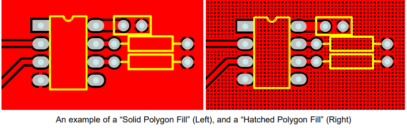

# PCB 设计入门指南  
> 本文是 [PCB Design Tutorial by David Jones](https://alternatezone.com/electronics/files/PCBDesignTutorialRevA.pdf) 的翻译版本，原作者是 David L. Jones。该文章发布于2004年，部分内容可能随着时间的推移已经不准确或过时（但是基本的PCB设计技巧应该不会这么快改变，但愿）此外，

### 翻译术语对照表（用于纠错）
+ track：走线，与 IPC 的说法保持一致
+ routing：布线，与多数 EDA 软件保持一致
+ routing tracks：铺设走线
+ thou：长度单位，千分之一英寸，不做翻译
+ mil：长度单位，千分之一英寸，不做翻译
+ PCB：印刷电路板
+ Snap Grid：捕捉网格，某商业软件习惯称之为捕捉栅格，感觉过于复杂，反正都是一个东西

### 简介
你已经设计好了你的电路，你甚至或许已经用面包板制作出了一个原型，现在是时候把它编程一个漂亮的印刷电路板（Printed Circuit Board，PCB）设计了。对于一些设计师来说，PCB 设计是设计流程中顺其自然且十分轻松的延伸，但对于许多其他的人来说，设计和布局（Lay out） 一张 PCB 的过程可能是一项非常艰巨的任务。甚至有些非常有经验的电路设计师对PCB设计知之甚少，因此把它留给了 "专家 "————专业的 PCB 设计工程师。许多公司甚至有自己专门的PCB设计部门。这并不奇怪，考虑到将数百个元件和数千条走线（track）安置在一个复杂的（有人说是艺术性的）设计中，以满足大量的物理和电气要求，往往需要大量的知识和才能。正确的 PCB 设计往往是设计中不可或缺的一部分。在许多设计中（高速数字、低电平模拟和射频等等），PCB 布局可能决定了设计的运行和电气性能。必须记住的是，PCB 线路有电阻、电感和电容，就像你的电路那样。  

这篇文章的目的是希望能消除 PCB 设计的一些神秘感。它给出了一些建议和"经验法则"，说明如何以专业的方式设计和布局你的PCB。然而，试图 "教导 "PCB 设计是相当困难的。有许多基本规则和良好做法需要遵循，但除此之外，PCB设计是一个高度创造性和个性化的过程。这就像试图教别人如何画画一样。每个人都会有自己的独特风格，而有些人可能根本没有创造性的天赋  

事实上，许多PCB设计师喜欢把PCB布局看作是艺术品，因为它们的美丽和优雅而被人欣赏。"如果它看起来不错，它就能很好地工作。"这是一句老话。
让我们一起来看看吧...

### 旧的年代
在计算机 CAD 之前的日子里，PCB 的设计和铺设都是用透明草纸上的胶布和焊盘手工进行的。许多时间都是懒洋洋地趴在日光灯箱上，用手切割、放置、撕开和铺设走线。Bishop Graphics、Letraset，甚至是 Dalo 钢笔，这些名字都会唤起人们美好的或不那么美好的回忆。那些日子已经一去不复返了，基于计算机的 PCB 设计已经完全取代了这种方法。
在业余爱好和专业电子领域都完全取代了这种方法。基于计算机的 CAD 程序允许在电路板设计和编辑方面比传统技术具有最大的灵活性。过去需要几个小时的工作现在可以在几秒钟内完成。

### PCB 设计软件包
市场上有许多 PCB 设计软件包，其中一些是免费软件、共享软件或有限元件的完整版本。在澳大利亚，Protel 是事实上的工业标准软件包。专业人士使用昂贵的基于Windows的高端软件包，如 99SE 和 DXP。业余爱好者使用优秀的基于 DOS 的免费软件 Protel AutoTrax 程序，它曾经是澳大利亚的高端软件包的选择。令人困惑的是，现在有另一个基于 Windows 的软件包也叫 AutoTrax EDA。这与 Protel 的软件没有任何关系。本文并不侧重于任何一个软件包的使用，所以这些信息几乎可以应用于任何可用的 PCB 软件包。然而，有一个明显的例外。使用不具有原理图功能，而仅能绘制 PCB 设计功能的软件包，将会极大的限制你在专业认知上对该软件包的操作。以后描述的许多更高级的技术需要使用兼容的原理图编辑程序。这一点将在需要时加以说明。  

> 译者注：在 2022 年，建议使用自由软件 KiCad (发音为 /ˈkiːˌkæd/ KEE-kad )

### 标准  
PCB设计的几乎每个方面都有工业标准。这些标准由来的电子电路互连和封装协会（Institute for Interconnecting and Packaging Electronic Circuits）控制，该协会现在被简称为IPC（www.ipc.org）。对于PCB设计、制造、测试以及你可能需要的其他任何方面，都有IPC标准。涵盖PCB设计的主要文件是IPC-2221，"印刷电路板设计通用标准"。该标准取代了过去半个世纪以来一直使用的旧IPC-D-275标准（也是军事标准275）。
当地国家对PCB设计和制造的许多方面也有自己的各种标准，但总的来说，IPC标准是全世界公认的行业标准。  

印刷电路板也被称为（有人会说，更正确的叫法是）印刷线路板（Printed Wiring Boards），或简称为印刷板（Printed Wiring Boards）。但我们将在本文中采用更常见的术语PCB。

### 原理图（schematic）
在你开始布局你的 PCB 之前，你**必须有一张完整且准确无误的原理图**。在你开始布置你的PCB之前，你必须有一个完整和准确的原理图。许多人在设计PCB时，除了脑子里的电路外，什么都没有，或者把原理图画在松散的便签纸上，没有引脚编号，也没有顺序，就直接进入了PCB设计，这还不够好。如果你没有准确的原理图，那么你的PCB很可能最终会变成一团糟，并花费你两倍的时间。

"Garbage-in, garbage-out"是一句经常使用的话，它同样适用于PCB设计。PCB设计是你的原理图的制造版本，因此，PCB设计自然会受到原始原理图的影响。如果你的原理图是整洁的、有逻辑的、布局清晰的，那么它确实会使你的PCB设计工作变得容易得多。好的做法是将信号从左边的输入流向右边的输出。正确绘制电气上的重要部分，按照设计者希望的方式布置在PCB上。比如把旁路电容放在它们要用的元件旁边。原理图上有助于布局的小注释是非常有用的。例如，"这个引脚需要一个信号地的保护走线"，这样就可以让布置电路板的人清楚地知道必须采取哪些预防措施。即使是由你来设计电路和绘制原理图，注释不仅可以在布置电路板时提醒自己，而且对审查设计的人也很有用。

你的原理图确实应该在绘制时考虑到PCB的设计。

详述良好的原理图设计超出了本文的范围，因为这需要一篇完整的文章。

### 英制（Imperial）和公制（Metric）
关于PCB设计，首先要知道使用什么测量单位以及它们的常用术语。

因为它们可能非常令人困惑!

任何长期从事PCB设计的人都会告诉你，你在设计PCB时应始终使用英制单位（即英寸）

这不仅仅是为了怀旧（虽然这也是一个主要原因！大部分电子元件过去（现在也是）以英制引脚间距制造。因此，现在不是固执己见，拒绝使用除公制单位以外的任何单位的时候了。公制单位会使你的电路板的铺设变得更加困难和混乱。如果 如果你足够年轻，在公制时代长大，那么你最好开始学习什么是英寸以及如何转换它们。

PCB设计中的一句老话是 "你要用 thou"。在你知道什么是 "thou "之前，这有点令人困惑。thou "是1/1000英寸，被世界各地的PCB设计师和制造商普遍使用和认可。都认可。因此，开始练习用 "10 thou spacing（10 thou 的间距） "和 "25 thou grid（25 thou 的网格） "说话，你会听起来像个专家

现在你明白了什么是 "thou"，我们将用 "mil"（或 "mils"）这个术语再做一次解释。1 mil "与1thou相同，并且不能与毫米（mm）混淆，后者通常与 "mil "同音。术语 "mil"来自于 1 thou 等于 1 mil 英寸。一般来说，避免使用 "mil "而坚持使用 "thou"，当试图向那些不懂公制的 PCB 人解释 PCB 尺寸时，这样会比较容易混淆，会比较容易混淆。  

一些PCB设计者会告诉你，在任何与PCB设计有关的事情上都不要使用公制毫米。在 但在实际生活中，你必须同时使用英制英寸（inches，thous）和公制毫米（millimeter，mm）。那么，用那种单位来表示什么东西？一般来说，走线、焊盘、间距和网格使用 thou，这是大部分的 你的基本 "设计和布局 "要求。只有在"机械和制造 "类型的要求中才使用毫米 要求，如孔的尺寸和板的尺寸。

你会发现，许多PCB制造商也会遵循这些基本准则，因为当他们要求你提供制造电路板的报价细节。大多数制造商使用公制尺寸的钻头，所以指定英制尺寸的孔真的会适得其反，而且容易出现错误。

为了进一步混淆这个问题，有许多元件（新的表面贴装部件就是一个例子） 都有公制的引脚间距和尺寸。所以你经常要用公制的网格和焊盘来设计一些元件的脚印。公制网格和焊盘。许多元件的数据表也有公制尺寸，尽管其间距 是按照英制网格设计的。如果你看到一个 "奇怪 "的公制尺寸，如 1.27 毫米，你可以确定它实际上有一个漂亮的整数。非常确定它实际上有一个漂亮的整数英制等价物。在这种情况下，1.27mm 就是 50thou。  

是的，PCB设计可能会让人迷惑不解! 因此，无论你在PCB设计中要做什么，你都需要成为英制到公制转换的专家。

反之亦然。为了使你的生活更轻松，所有主要的PCB制图软件包都有一个 "热键"，用于 在英制和公制单位之间即时转换（例如Protel的 "Q"）。如果你能记住几个转换键，会对你有很大帮助 

记住几个转换键，如100thou (0.1 inch) = 2.54mm，200thou (0.2 inch) = 5.08mm等。

100thou及以上的数值通常以英寸为单位，而不是以千为单位。所以0.2英寸比200英寸更常用。

因此，0.2英寸比 200thou 更常用。

1 英寸通常也被称为1 "pitch (间距)"。所以经常听到 "0.1英寸间距 "这个短语，或者更简单的是 "0.1 pitch"，并假定是英寸单位。这通常用于元件的引脚间距。

100thou 是 PCB 设计所有方面的一个基本 "参考点"，而大量的普通元件引线 
间距是这个基本单位的倍数或分数。50 和 200thou 是最常见的。

与世界其他地区一样，IPC的标准也都是公制的，只是偶尔会提到英制单位。不过，这并没有真正改变PCB行业的现状。旧习难改，英制单位在许多实际使用领域仍然占据主导地位。

### 依照网格（Grids）工作
PCB设计的第二个主要规则，也是初学者最常错过的规则，是将电路板布置在固定网格上。这称为"捕捉网格（Snap Grids）"，因为您的光标、元件和走线将"捕捉（Snap）"到固定的网格位置。不仅仅是任何大小的网格，而是一个相当稀疏的网格。100 thou是用于非常基本的通孔工作的标准放置网格，50 thou是一般走线工作的标准，例如在通孔焊盘之间运行走线。对于更精细的工作，您可以使用25 thou的卡扣网格甚至更低。例如，许多设计师会争论20 thou网格与25 thou网格的优点。在实践中，25 thou通常更有用，因为它允许您在50 thou间隔焊盘之间正好走一半

为什么稀疏的捕捉网格如此重要？这很重要，因为它将使您的元件保持整洁和对称;如果可以的话，在美学上令人愉悦。它不仅是为了美观 - 随着布局大小和复杂性的增长，它使走线，元件和元件块的未来编辑，拖动，移动和对齐变得更加容易。

糟糕和业余的PCB设计是可以立即识别的，因为许多走线不会完全排列在焊盘的中心。一些小的走线将被"粘合"以填补空白等。这是由于没有有效地使用捕捉网格。

良好的PCB布局实践包括从 50 这样的稀疏网格开始，如果您的设计在空间上变得"紧凑"，请使用逐渐精细的捕捉网格。在需要时降至 25 和 10，以获得更精细的布线和元件放置。这对电路板上99%的部分都适用。确保您选择的更精细的网格是标准100 thou的良好均匀划分。这意味着 50、25、20、10 或 5。不要使用其他任何东西，你会后悔的。 

一个好的 PCB 软件包将具有热键或可编程宏键，以帮助您立即在不同的卡扣网格大小之间切换，因为您需要经常这样做。 

PCB绘图软件包（drafting package）中有两种类型的网格，其一是先前讨论的捕捉网格，以及"可见（visible）"网格。可见网格是一个可选的屏幕网格，由实线、虚线或点组成。这显示为设计背后的背景，并极大地帮助您排列元件和走线。您可以将捕捉网格和可见网格设置为不同的单位（公制或英制），这通常非常有用。许多设计师更喜欢100个可见的网格，很少与此不同。

一些程序还具有所谓的"电气（Electrical）"网格。此网格不可见，但是当光标足够接近时，它会使光标"捕获"到走线和焊盘等电气对象的中心。这对于手动布线、编辑和移动对象非常有用。 最后一种类型的网格是"元件"网格。这与对齐网格的工作原理相同，但仅用于元件移动。这允许您将元件对齐到不同的网格。确保将其设置为捕捉网格的倍数。 当您开始布置第一块板时，捕捉网格可能会感觉有点"有趣"，您的光标只能按步骤一格一格移动。与大家都熟悉的普通绘画软件不同。但它很容易习惯，您的PCB设计将更接近整洁和专业。

### 依照自顶向下的方法工作
PCB设计开始工作总是从电路板的顶部开始，通过各个层进行观察，就好像它们是透明的一样。这就是所有PCB封装的工作原理。您唯一会从底部查看电路板的时间是用于制造或检查目的。这种"通过电路板"的方法意味着你将不得不习惯于将底层的文本作为镜像阅读，习惯它！

### 走线（Tracks）
走线尺寸没有推荐的标准。您使用的走线尺寸将取决于（按重要性排序）  

+ 设计的电气要求
+ 可用的布线空间和间隙
+ 个人偏好

每个设计都有一组不同的电气要求，这些要求可能因电路板上的走线而异。除基本非关键设计外，所有设计都需要混合走线尺寸。但作为一般规则，走线宽度越大越好。较大的走线具有较低的直流电阻，较低的电感，制造商可以更容易，更便宜地进行蚀刻，并且更容易检查和返工。 

走线宽度的下限将取决于PCB制造商能够达到的 "最小线宽/线距（track/space）" 分辨率。例如，制造商可能会引用 10/8 的 线宽/线距 数字。这意味着走线可以不小于 10thou宽，走线（或焊盘，或铜的任何部分）之间的间距可以不小于 8thou。这些数字几乎总是以 thou 引用，首先是走线宽度，然后是间距。 

现实中的典型数字是 10/10 和 8/8 。对于基本板，IPC标准建议将 4thou 作为下限。但是，一旦您达到 6thou 及以下走线，您就将面临严峻的问题，您应该首先咨询您的电路板制造商。走线/空间数字越低，制造商在对齐和蚀刻电路板时必须更加小心。他们会把这笔费用转嫁给你，所以确保你不会比你需要的低。作为指导，使用激光打印透明胶片和预涂覆光刻胶板等"自制"PCB制造工艺，可以轻松获得 10/10 甚至 8/8 的间距。

仅仅因为制造商可以实现一定的走线/间距，就没有理由用您的设计"突破极限"。使用尽可能大的走线/间距，除非您的设计参数需要更小的走线/间距。
 
首先，您可能希望将 25 thou 用于信号走线，50 thou 用于电源和接地走线，10-15 thhou 用于 IC 和元件焊盘之间。一些设计师喜欢较小的信号走线的"外观"，如10或15 thou，而另一些设计师则喜欢他们所有的走线都是大而"厚重"的。良好的设计实践是保持走线尽可能大，然后仅在需要满足间隙要求时才更改为更薄的走线。  

将走线从大到小，然后再变回大被称为"necking"或"necking down"。当您必须在IC或元件焊盘之间移动时，通常需要这样做。这允许您拥有漂亮的大低阻抗走线，但仍然可以灵活地在狭窄点之间布线。 

在实践中，您的走线宽度将由流经它的电流，以及您愿意容忍的走线的最大温升决定。请记住，每个走线都会有一定量的电阻，因此走线将像电阻器一样散热。走线越宽，电阻越低。PCB上铜的厚度也会发挥作用，任何焊接涂层表面也会受到影响。

PCB上铜的厚度名义上以盎司每平方英尺（ounces per square foot）为单位，其中1盎司铜是最常见的。您可以订购其他厚度，如0.5盎司，2盎司和4盎司。较厚的铜层适用于高电流、高可靠性设计。 根据电流和最大温升计算出所需走线宽度的计算有点复杂。它们也可能非常不准确，因为该标准基于大约半个世纪前测量数据的一组非线性图形。这些仍然在IPC标准中复制。

在 www.ultracad.com/calc.htm 可以找到一个方便的走线宽度计算器程序，并根据IPC图形给出结果。 

根据经验，走线上10摄氏度的温升是设计中一个很好的安全限制。本文中包含了一个方便的参考表，为您提供了10°C上升时走线宽度与电流的列表。还显示了以每英寸毫欧姆为单位的直流电阻。当然，走线越宽越好，所以不要盲目地照搬表格。

<table>
    <tr>
        <td colspan=4>走线宽度参考表（10摄氏度温升）走线宽度单位为thous（mils）</td>
    </tr>
    <tr>
        <td>电流</td>
        <td>1 盎司铜厚的线宽</td>
        <td>2 盎司铜厚的线宽</td>
        <td>电阻毫欧每英寸</td>
    </tr>
    <tr>
        <td>1</td>
        <td>10</td>
        <td>5</td>
        <td>52</td>
    </tr>
    <tr>
        <td>2</td>
        <td>30</td>
        <td>15</td>
        <td>17.2</td>
    </tr>
    <tr>
        <td>3</td>
        <td>50</td>
        <td>25</td>
        <td>10.3</td>
    </tr>
    <tr>
        <td>4</td>
        <td>80</td>
        <td>40</td>
        <td>6.4</td>
    </tr>
    <tr>
        <td>5</td>
        <td>110</td>
        <td>55</td>
        <td>4.7</td>
    </tr>
    <tr>
        <td>6</td>
        <td>150</td>
        <td>75</td>
        <td>3.4</td>
    </tr>
    <tr>
        <td>7</td>
        <td>180</td>
        <td>90</td>
        <td>2.9</td>
    </tr>
    <tr>
        <td>8</td>
        <td>220</td>
        <td>110</td>
        <td>2.3</td>
    </tr>
    <tr>
        <td>9</td>
        <td>260</td>
        <td>130</td>
        <td>2.0</td>
    </tr>
    <tr>
        <td>10</td>
        <td>300</td>
        <td>150</td>
        <td>1.7</td>
    </tr>
</table>

### 焊盘（Pads）
焊盘的大小、形状和尺寸不仅取决于你所使用的元件，而且还取决于组装电路板的制造工艺，以及其他事项。有一系列的标准和理论，这将在后面解释。在这个阶段，我只想说你的 PCB 软件包应该有一套基本元件库，可以让你开始使用。对于所有的的基本元件库，你都必须修改这些基本元件以适应你的目的。随着时间的推移，你将建立起自己的元件库，以满足各种需求。

有一个重要的参数被称为焊盘/孔比率。这是焊盘尺寸与孔尺寸的比率。每个制造商都会有自己的最低规格。作为一个简单的经验法则，焊盘应至少是孔直径的1.8倍，或至少大0.5毫米。这是为了允许钻头和顶层和底层的底片（artwork）的对准公差。焊盘和孔越小，这个比例就越重要，特别是与通孔有关。

当涉及到通用元件焊盘时，有一些常用的做法。有引线的元件的焊盘如电阻、电容和二极管，应该是圆形的，直径约为 70 thou。
双列直插(DIL 或 DIP)元件，如IC，更适合使用椭圆形的焊盘(常见的是 60 thou 高，90-100 thou 宽)。芯片的第 1 个引脚应该总是一个不同的焊盘形状，通常是矩形的，并且与其他引脚的尺寸相同。

大多数表面贴装元件使用矩形焊盘，尽管表面贴装 SO 封装的 IC 应该使用椭圆形的 
焊盘。同样，1号引脚是矩形的。

其他依赖引脚编号的元件，如连接器和SIP电阻包，也应遵循 "1号引脚为矩形 "的原则。

八边形焊盘很少使用，并且应当避免去使用它

一般来说，使用圆形或椭圆形的焊盘，除非你需要使用矩形的。

### 过孔（Vias）
导线通过电路板上的一个孔，将走线从电路板的一侧连接到另一侧。除了廉价的手工制作PCB和低端的商业原型，通孔都是用电镀孔制作的，称为电镀孔（PTH）。
电镀通孔（Plating Through Hole, PTH）。电镀通孔允许你的电路板上的不同层之间进行电气连接。

通孔和焊盘之间有什么区别？实际上没有什么区别，它们都是只是电镀孔。但当涉及到PCB设计封装时，还是有区别的。焊盘和通孔是，而且应该是，不同的对待。你可以在全局范围内分别编辑它们，并做一些更高级的以后再讨论。所以不要用焊盘来代替通孔，反之亦然。

通孔中的孔通常比元件焊盘要小一些，典型的是0.5-0.7毫米。

使用通孔连接两个层通常被称为 "缝合（stitching）"，因为你实际上是将两个层电性地缝合在一起，就像在材料中来回穿针引线。在谈话中多说几遍缝合这个词，你就会觉得自己像个PCB专家了。

### 多边形（Polygons）
许多PCB封装上都有 "多边形"。多边形会自动用铜填充（或 "淹没"）一个所需的区域。，并在其他焊盘和走线周围 "流动"。它们对于铺设地平面非常有用。请注意 
确保你在放置了所有的走线和焊盘之后再放置多边形。

多边形可以是 "实心 "的铜线填充，也可以是纵横交错的铜轨 "网格铺铜（Hatched）"。实心的填充物是 
是首选的，网格铺铜基本上是过去的事情了。

### 间隙（Clearances）
电气间隙是所有电路板的一个重要要求。走线和焊盘之间的间隙太小可能导致制造过程中的微短路（Hairline Short Circuits）和其他蚀刻问题。一旦你的板子组装好了，这些问题可能会非常 一旦你的板子被组装好了，就很难发现故障。再次强调，不要 "挑战 "制造商的极限，除非你不得不这样做。你必须这样做，如果可能的话，保持高于他们推荐的最小间距。

对于基本的通孔设计来说，至少15thou是一个很好的间隙限制，10thou或8thou则用于更密集的表面贴装布局。如果你低于这个限度，最好先咨询一下你的PCB制造商。

对于PCB上的240V电源，有各种法律要求，如果你要做这种工作，你需要咨询相关标准。作为一条经验法则，240 走线和隔离信号走线之间应允许有绝对的最小8毫米（315thou）的间距。良好的设计实践表明，无论如何你都会有比这大得多的间隙。

对于非主电源电压，IPC标准有一套表格，规定了各种电压所需的间隙。这里显示了一个简化的表格。该间隙将取决于走线是在内部层还是在外部表面。由于在高海拔地区大气层变薄，它们也会随着电路板在海平面以上的运行高度而变化。在给定的间隙内，敷形涂层也能改善这些数据，这通常用于军用规格的PCB。

<table>
    <tr>
        <td colspan="4" style="text-align:center">导体的电气间隙
</td>
    </tr>
    <tr>
        <td>电压（直流或交流峰值）</td>
        <td>内层</td>
        <td>外层（海拔 3050 m 以下）</td>
        <td>外层（海拔 3050 m 以上）</td>
    </tr>
    <tr>

    </tr>
</table>

## 元件放置与设计
有句老话说，PCB设计90%是贴片，10%是布线。虽然实际数字并不重要，但元件放置是迄今为止布局电路板的最重要方面的概念肯定是正确的。好的元件摆放会使你的布局工作更容易，并提供最佳的电气性能。糟糕的元件放置会使你的布线工作变成一场噩梦，并带来糟糕的电气性能。它甚至可能使你的电路板无法生产。因此，在放置元件时，有很多事情需要考虑。
每个设计者都有自己放置元件的方法，如果你把同样的电路（不管是 如果你把同一个电路（无论多么简单）交给100个不同的有经验的设计师，你每次都会得到100种不同的PCB布局。因此，没有 
没有绝对正确的方法来放置你的元件。但是，有一些基本的规则可以帮助你缓解 路由，使你获得最佳的电气性能，并简化大型复杂的设计。
在这一点上，让你了解一下布置一块完整的电路板所需的基本步骤是个好主意。

+ 设置你的捕捉网格、可见网格和默认的走线/焊盘尺寸。
+ 将所有元件扔到板上。
+ 在可能的情况下，将你的元件划分并放置到功能 "模块（building blocks） "中。
+ 识别电路上的关键走线，并首先对其进行布线。
+ 将每个元件单独放置在电路板上，并进行布线。
+ 将已完成的元件移到电路板上的位置。
+ 将剩余的信号和电源连接在模块之间进行布线。
+ 对电路板进行一般的 "整理"。
+ 做一个设计规则检查。
+ 找人检查一下

这绝不是一个万能的检查清单，它取决于许多因素，变化很大。但它是制作专业的一流 lay-out 设计的一个很好的一般指南。

让我们更详细地了解一下上述的程序

我们已经看了网格和走线/焊盘的尺寸，这些应该是你在开始做任何事情之前首先设置的东西。没有例外!

许多人喜欢直接把所有的部件放到他们认为最理想的 在电路板上的最佳位置，一气呵成。虽然这对小电路来说是可行的，但当你有更复杂的电路，有数百个元件时，你就没有什么希望了。你有更复杂的电路，有数百个元件分布在许多功能电路块上。

为什么呢？因为很容易出现 "布线空间"，也就是铺设所有走线的空间。如果你 固定所有元件的位置，然后试图对所有元件进行布线，你就很容易把自己陷入困境。
可以这么说。另外，如果你把元件放得太满，你可能会得到一块大板子，不能有效地利用空间。不能有效地利用空间。

一个没有经验的设计者的标志是，在一块电路板上，每一个元件都被均匀地隔开，然后有 数以千计的走线和通孔纵横交错在电路板上。这可能是有效的，但它可能是丑陋和低效的，更不用说更大和更昂贵的制造。更不用说更大和更昂贵的制造成本了。·                                                                                                                                                                                                                                             

开始布局的最好方法是先把所有的元件都放到屏幕上。

如果你有一个配套的原理图软件包，那么最简单的方法是让你的PCB程序 导入你的原理图设计并自动选择所有的元件。这一点也将在后面讨论。如果 你所拥有的只是一个PCB程序，那么你就必须从库中选择每个元件，并把它们放在下面 手动放置。

在屏幕上显示出所有的元件后，你应该能很好地了解到你的元件是否能很容易地适应 在你所需要的板子的尺寸（和形状）上。如果它看起来会很紧，那么你就有的忙了，要试图保持元件间距的 "紧凑"，并尽可能有效地布线。如果看起来你有足够的空间，那么你可以在布局上更自由一些。当然，如果它 看上去你有机会把你的元件放在板子上，你就必须回到 绘图板。

现在分析你的原理图，并确定设计的哪些部分可以被分解成 "模块"。

这通常是相当明显的。例如，你的电路中有一个看起来很复杂的有源滤波器。这将是 这通常有一条输入线和一条输出线，但它会有很多元件和连接作为滤波器的一部分。滤波器的一部分。这是一个典型的 "积木式 "电路，它可以很好地将所有这些部件组合在一起。部件组合在一起。因此，你可以把所有这些部件抓起来，然后开始把它们重新排列到它们的 自己的小布局，放在电路板的一侧。不要太担心实际的块在你的电路板上的位置 板上的位置。

你还需要将你的设计中对电敏感的部分分割成更大的块。一个主要的 一个主要的例子是混合数字和模拟电路。数字和模拟是不能混合的，因此需要在物理和电气上将它们分开。需要在物理上和电气上进行分离。另一个例子是高频率和大电流的电路，它们不能与低频率和低电流的电路混合。它们不能与低频率和低电流敏感的电路混合。稍后会有更多关于这方面的内容。
一般来说，你的元件应该整齐地排好。将集成电路排在同一方向，电阻排成整齐的一列，极化电容排在同一方向，连接器排在电路板的边缘。不过，不要以牺牲电气性能差的布局或过大的电路板为代价来实现这一点。电气参数应始终优先于排列整齐的元件。

在PCB设计中，对称性是非常好的，它具有美感，而且 "看起来很好"。如果你有两个相同的积木式电路，而其中一个的布局略有不同，那么它就会像一个大拇指一样突出。

如果你明智地放置了你的元件，你90%的工作就完成了。最后的10%应该只是把这些点连接起来，可以这么说。好吧，不完全是，但良好的布局是你工作的大部分。

一旦你对元件的位置感到满意，你就可以开始对所有不同的元件独立的进行布线。完成后，通常只需将这些元件移到设计的其余部分并进行排列即可。

设计规则检查（Design Rule Check，DRC）将在后面讲到，但它是确保你的电路板在制造前正确的一个重要步骤。在制造之前是正确的。DRC基本上是检查你的走线连接是否正确，以及正确的宽度和间隙。
找人检查你的电路板可能听起来是一个过于官僚的过程，但这确实是一个重要的步骤。

无论你在PCB设计方面的经验有多丰富，总会有一些你忽略的东西。一双新的眼睛和不同的思维方式会发现你永远看不到的问题。

"网络（Net）"连接与原理图进行比较，一个网络一个网络地进行。当你完成时，在原理图上突出每一个网络。当你完成后，应该没有任何电气连接没有被突出显示。你现在可以确信你的电路板在电气上是正确的。

### 基础的布线（Basic Routing）
现在是时候说说一些基本的布线（Routing）规则了。布线也被称为 "走线（tracking）"。
路由是在电路板上铺设走线来连接元件的过程。两个或多个焊盘之间的电气连接 两个或多个焊盘之间的电气连接被称为 "网络"。
+ 网络的长度应当尽可能的短。走线总长度越长，它的电阻，电容和电感就越大。所有这些都可能是不理想的因素。
+ 走线角度应当仅为45度。避免使用直角，并且在任何情况下都不能使用大于90度的角度（锐角），这一点很重要，因为它能使你的电路板有一个专业和整洁的外观。这一点很重要，可以给你的电路板带来专业和整洁的外观。PCB封装会有一个强制 45 度移动的模式，把它用上，并且应该永远不需要把它关掉。与人们的想法相反，走线上的锐角或直角走线并不产生可测量的EMI或其他问题。避免直角的原因要简单得多--只是因为不好看，而且可能有一些制造方面的影响。
+ 忘了看起来很高级的弧形走线，它们更难、更慢地放置，没有真正的优势。坚持使用45度的增量。圆润的走线拐角属于前计算机辅助设计（CAD）时代的图样。
+ 在板子的周围进行 “蛇形” 走线，不要只是去 "点对点"。对初学者来说，点对点的走线可能看起来 对初学者来说，点对点走线可能看起来更有效，但有几个原因你不应该使用它。第一个原因是，它很 丑陋，这在PCB设计中一直是一个重要因素。第二个原因是，当你想在其他地方运行更多的走线时，它的空间效率并不高。
当你想在其他层上运行更多的走线时，它的空间效率并不高。
+ 启用你的电气网格（Electrical grid，也叫电气栅格），这有时被称为 "捕获到中心（snap to center）"或 "捕获到最近（snap to nearest）"选项。让软件为你自动找到焊盘的中心和走线的末端。当你的焊盘和走线没有排到你当前的捕捉网格时，这很好。如果你没有启用这些选项，那么你可能不得不不断减少你的捕捉网格，直到你找到一个合适的网格。这种麻烦远远超过它的价值。几乎没有理由禁用这些选项。
+ 始终把你的走线带到焊盘的中心，不要让你的走线和焊盘 "刚好接触"。有 有几个原因。第一个原因是，这样做很草率，很不专业。第二个原因是，你的程序 可能不认为走线与焊盘是在进行电气连接。适当地使用扣网和 
电网的正确使用将避免在这里出现问题。
+ 使用单一的走线，而不是多个走线端对端地粘在一起。这可能对你最终的电路板的外观没有什么影响，但是对于未来的编辑来说，这可能是一个麻烦。通常情况下，你必须将走线延长一些。在这种情况下，最好是删除旧的走线，然后放置一个新的。这可能要多花几秒钟，它是值得的。人们看了你完成的板子可能不知道，但你会知道正是这样的小细节让优秀的PCB设计师脱颖而出。
+ 确保你的走线正好穿过焊盘和元件的中心，而不是偏向一边。一边。使用正确的网格可以确保你每次都能做到这一点。如果你的走线没有穿过 准确地穿过中心，那么你就使用了错误的扣网。为什么需要这样做？它能使你的电路板更整齐、更对称，而且能给你最大的间隙。
+ 除非绝对必要，否则只在100英亩的焊盘之间采取一个走线。只有在大型和非常密集的 设计时，你才应该考虑在焊盘之间采用两条走线。焊盘之间有三条走线的情况也不是没有过。但我们在这里讨论的是严重的精细公差。
对于大电流，在层与层之间使用多个通孔。这将减少你的走线阻抗并提高可靠性。只要你需要降低走线或电源平面的阻抗，这就是一条通用规则。
+ 不要将走线 "拖 "到45度以外的角度。
+ 尽可能在焊盘之间 "缩颈"。例如，一个10英寸的走线穿过两个60英寸的焊盘，在走线和焊盘之间有15英寸的间隙。
+ 如果你的电源和地面走线被认为是关键的，那么就先铺设它们。此外，使你的电源走线尽可能宽。
+ 如果可能的话，保持电源和地线相互靠近，不要让它们在电路板上的方向相反。这可以降低电源系统的环路电感，并允许有效的旁路。
+ 保持对称。从专业美学的角度来看，跟踪和元件放置的对称性是非常好的。
+ 不要留下任何未连接的铜填充物（也称为 "孤铜"，“铜孤岛”），将其接地或取出。
+ 如果你正在铺设一个非电镀通孔的双面板，那么还有一些额外的事情需要注意。非电镀通孔要求你在顶层和底层都要焊接一条贯穿电路板的链接。
+ 不要在元件下面放置通孔。一旦元件被焊接到位，你将无法接触到该连接点来焊接贯通。贯通的焊点也会干扰到元件。
+ 尽量使用通孔元件脚来连接顶部走线和底部走线。这样可以最大限度地减少通孔的数量。记住，每个通孔都会给你的电路板增加两个焊点。你有的焊点越多，你的电路板就越不可靠。更不用说它需要更多的时间来组装了。
+ 
### 最后的修饰

### 单侧设计

### 两侧设计

## 其他层 