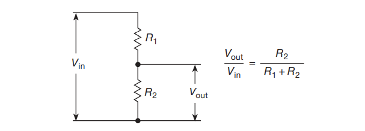
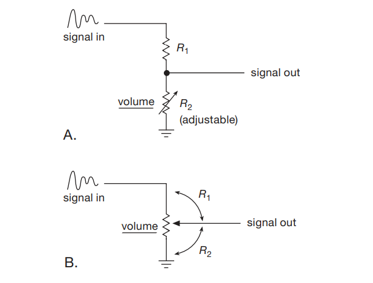
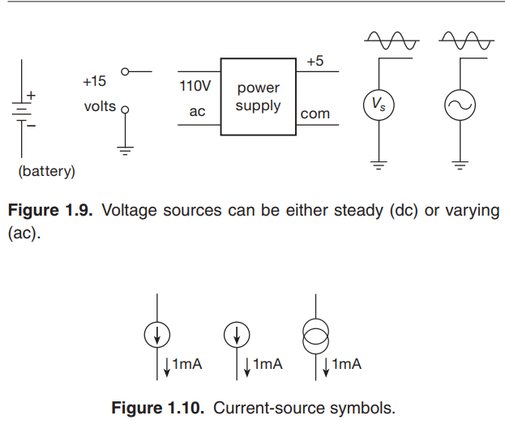

# 基本元件-电压，电阻，电感，磁珠
> 本文是对 The Art of Electronics 第三版的快速阅读笔记

## 电压，电流

## 电阻
中学已经学习过电阻的定义式

<!-- $$
R=\frac{U}{I}
$$ --> 

甚至还学过电阻的串并联定律

### 串联

<!-- $$
R=R1+R2+R3...
$$ --> 

<!-- $$
R = \frac{1}{\frac{1}{R1}+\frac{1}{R2}+\frac{1}{R3}...}
$$ --> 

### 并联

### 贴片电阻的封装
贴片电阻和其他用于表面安装的元件的尺寸由一个四位数的尺寸代码指定，其中每对尺寸代码都是一个数字。的尺寸是由四位数的尺寸代码指定的，其中每一对 每对数字指定一个尺寸，单位为0.010′′（0.25毫米）。例如，一个 0805 尺寸的电阻是 2 毫米 × 1.25 毫米，或 80 mil ×50 mil（1 mil 为0.001′′）。是0.001′′）；高度必须单独指定。为了给这个简单的方案增加混乱，四位数的尺寸代码可能是公制的。
(有时不说出来！），以0.1毫米为单位：因此 "0805"（英文）也是 "2012"。(英文)也是 "2012"（公制）。

### 电阻分压器（Voltage dividers）

#### 普通的

#### 可调的（使用可变电阻器或者一串的阻值相等的电阻，用电子开关切换）

显然，有如下公式成立

<!-- $$
Iout = \frac{Vin}{R1+R2}
$$ --> 

<!-- $$
Vout = IR2 = \frac{R2}{R1+R2} Vin
$$ --> 

为什么叫分压器，因为输出电压总是小于输入电压（废话

但是，如果电阻是负的 ¿ ，输出电压就大于输入电压了

例如 具有 负“增量”的隧道二极管，甚至是真正的负电阻（负阻抗变换器），现在还不用管这些

如果Vin是一个变化的电压，R2是一个可调节的电阻（图1.7A），你就有一个 "音量控制"

作为一种思考电路的方式：输入电压和上边的电阻可能代表一个放大器的输出，例如，下边的电阻可能代表下一级的输入。在这种情况下，电压分配器方程告诉你有多少信号到达最后一级的输入。在你了解了以下情况后，这一切将变得更加清晰，后面将讨论一个非凡的事实（戴维南定理,Thevenin theorem），不过，首先要对电压源和电流源做一个简短的介绍。

## 电压源和电流源
