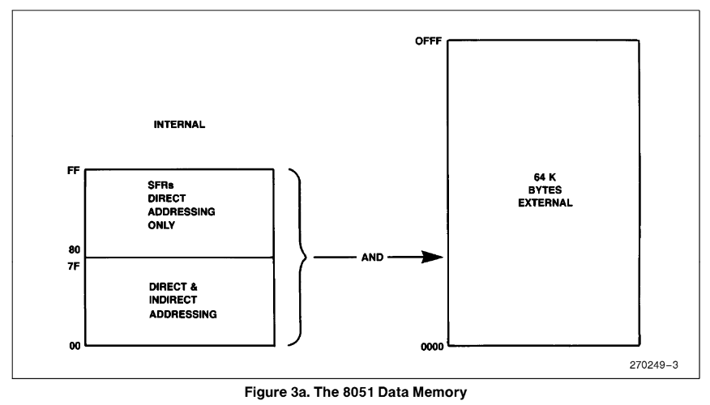

# Intel MCS-51 编程及指令集手册
> _Intel MCS-51 Programmer’s Guide and Instruction Set_ 的翻译

## 存储器结构
### 程序存储器

8051 拥有独立地址空间（address spaces）的程序存储器（Program Memory）和数据存储器（Data Memory）。程序存储器可以长达 64KB， 较低（地址）的 4K（对 8052 来说是8K）可能位于芯片上（reside on-chip）
  
  

### 数据存储器
8051 可以寻址多达 64KB 的片外数据存储器。`MOVX` 指令被用于访问外置存储器（详细描述参考 _MCS-51 指令集_ 章节）  
8051 拥有 128 字节的片上 RAM （8052 是 256 字节） 以及一些特殊功能寄存器（Special Function Registers, SFRs）. 较低（地址）的 128 bytes 既可以被直接寻址（MOV data addr）也可以被间接寻址（MOV @Ri），图 3 展示了 8051 和 8052 的数据存储器结构。  
  
  

### 间接寻址区域
注意图 3b 中 ，特殊功能寄存器（SFRs）和间接寻址 RAM 拥有相同的地址（80H-0FFFH）. 但是它们是用两种不同方式访问的，两块独立的区域  
例如指令：  
```
MOV    80H,#0AAH
```
将会写入 0AAH 到 Port 0，这是一个特殊功能寄存器，另一种指令：
```
MOV    R0,#80H
MOV    @R0,#0BBH
```
将会在数据 RAM 中的 80H 写入 0BBBH，因此，在执行了上述的两种指令后，端口 0 将包含 0AAH， RAM的 80 位置 将包含 0BBH。

> 注意，栈操作（Stack Operation，把 Stack 翻译成堆栈这合理吗？）是间接寻址的实例，所以在那些实现 256 字节内置 RAM 的设备中，数据 RAM 的上部 128 字节可用作栈空间。  

### 直接和间接寻址区域
可以通过直接和间接寻址访问的128字节的RAM可以分为3个部分（工作寄存器组区、位寻址区、数据缓冲区），如下图所示。
  
1. **寄存器组（Register Banks） 0-3**：位置从 0 到 1FH （32字节）。ASM-51 和以及复位后的设备默认为组0（Bank 0），使用其他的寄存器组必须在软件（参考 _MCS-51 Micro Assembler User's Guide_）每个寄存器组包含了 8 个单字节寄存器，从 0 到 7 。  
复位初始化栈指针（Stack Pointer，SP）到位置 07H 并且他被递增一次，从位置 08H 开始，，这是第二个寄存器组的第一个寄存器（RO）。因此，为了使用一个以上的寄存器组，SP应该被初始化到RAM中不用于数据存储的不同位置（即RAM的较高部分）。  
2. **位寻址区（Bit Addressable Area）**：该段有16个字节，20H-2FH。该段的128位中的每一位都可以被直接寻址（0-7FH）。  
这些位可以用两种方式来指代，这两种方式都是ASM-51可以接受的。一种方式是参考它们的地址，即0到7FH。另一种方式是参考字节20H至2FH。因此，0-7位也可以称为20.0-20.7位，8-FH位与21.0-21.7位相同，以此类推。  
本段16个字节中的每一个也可以作为一个字节来寻址。  
3.**数据缓冲区（Scrath Pad Area）**：30H 到 7FH 字节可以作为数据RAM提供给用户。但是，如果堆栈指针被初始化到这个区域，应该留出足够数量的字节以防止 SP 数据被破坏。  
### 特殊功能寄存器  
表 1 包含了所有 SFR 及其地址的列表。  
对比表 1 和图 5 可以看出，所有可寻址的字节和位的 SFR 都位于图 5 中的第一列(可以被8整除)。  

|符号 (Symbol）|名称（Name）                                   |地址（Address）|
|--------------|----------------------------------------------|---------------|
|*ACC          |累加器（Accumulator）                          |0E0H           |
|*B            |寄存器B                                        |0F0H           |
|*PSW          |程序状态字（Program Status Word）               |0D0H           |
|SP            |栈指针（Stack Pointer）                         |81H            |
|DPTR          |双字节数据指针（Data Pointer 2 Bytes）           |               |
|&emsp;DPL     |低字节（Low Byte）                               |82H            |
|&emsp;DPH     |高字节（High Byte）                              |83H            |
|*P0           |端口 0（Port 0）                                 |80H            |
|*P1           |端口 1（Port 1）                                 |90H            |
|*P2           |端口 2（Port 2）                                 |0A0H           |
|*P3           |端口 3（Port 3）                                 |0B0H           |
|*IP           |中断优先级控制（Interrupt Priority Control）      |0B8H           |
|*IE           |中断使能控制（Interrupt Enable Control）          |0A8H           |
|TMOD          |计时器/计数器模式控制（Timer/Counter Mode Control）|89H            |
|*TCON         |计时器/计数器控制（Timer/Counter Control）         |88H            |
|*+T2CON       |计时器/计数器 2 控制（Timer/Counter 2 Control）    |0C8H           |
|TH0           |计时器/计数器 0 高字节（Timer/Counter 0 High Byte）|8CH            |
|TL0           |计时器/计数器 0 低字节（Timer/Counter 0 Low Byte） |8AH            |
|TH1           |计时器/计数器 1 高字节（Timer/Counter 1 High Byte）|8DH            |
|TL1           |计时器/计数器 1 低字节（Timer/Counter 1 Low Byte） |8BH            |
|+TH2          |计时器/计数器 2 高字节（Timer/Counter 2 High Byte）|0CDH           |
|+TL2          |计时器/计数器 2 低字节（Timer/Counter 2 Low Byte） |0CCH           |
|+RCAP2H       |T/C 2 捕获寄存器高字节（T/C 2 Capture Reg High Byte)|0CBH           |
|+RCAP2L       |T/C 2 捕获寄存器低字节（T/C 2 Capture Reg Low Byte) |0CAH           |
|*SCON         |串口控制（Serial Control）                         |98H           |
|*SBUF         |串口数据缓冲（Serial Data Buffer）                 |99H           |
|PCON          |Power Control                                     |87H           |
> `*`表示可位寻址（Bit addressable）  
> `+`表示仅 8052 可用（8052 only）
### 上电或复位后，SFR包含什么内容？
表 2 列出了特殊功能寄存器在上电或者硬件复位后的内容：  
  


本节列出了那些为各种功能分配了位的 SFR。提供每个位的简要说明以供快速参考。有关更多详细信息，请参阅本书的架构章节。

### PSW：程序状态字（PROGRAM STATUS WORD）可位寻址
|CY|AC|F0|RS1|RS0|OV|——| P |
|--|--|--|---|---|--|--|---|

```
CY    PSW.7    进位标志位（Carry Flag）

AC    PSW.6    辅助进位标志位（Auxiliary Carray Flag）

F0    PSW.5    标志位0（Flag 0），可供用户用于一般用途

RS1   PSW.4    寄存器组选择位 1（Register Bank selector bit 1）（见附注 1）

RS0   PSW.3    寄存器组选择位 0 （见附注 1）

OV    PSW.2    溢出标志（Overflow Flag）

——    PSW.1    用户可定义标志（User definable flag） 

P     PSW.0    奇偶校验标志，由硬件在每个指令周期内设置/清除，以指示累加器中的奇数/偶数的'1'位。
```
附注1： 由 RS0 和 RS1 的值选择相应的寄存器组。  

|RS1|RS0|寄存器组（Register Bank）|  地址 |
|:-:|:-:|:----------------------:|:-----:|
| 0 | 0 |           0            |00H-07H|
| 0 | 1 |           1            |08H-0FH|
| 1 | 0 |           2            |10H-17H|
| 1 | 1 |           3            |18H-1FH|

### PCON 电源控制寄存器（POWER CONTROL REGISTER），**不可位寻址**
|SMOD|——|——|——|GF1|GF0|PD|IDL|
|----|--|--|--|---|---|--|---|

```
SMOD    双倍波特率位（doble baud rate bit）。如果定时器1倍用于生成波特率且SMOD=1，当串口被用于模式1,2,3时，波特率翻倍

——      没有实现，保留给未来使用（Not implemented, reserved for future use.*）

——      没有实现，保留给未来使用

——      没有实现，保留给未来使用

GF1     通用用途标志位。（general purpose flag bit）

GF0     通用用途标志位。

PD      掉电模式位（Power Down bit）。设置这个位可以激活 80C51BH 的掉电模式操作（仅在采用CHMOS工艺的型号中可用）  

IDL     空闲模式位（idle Mode bit）。设置这个位激活 80C51BH 中的空闲模式操作。（仅在采用CHMOS工艺的型号中可用）
```
>如果同时向 PD 和 IDL 写入 1，PD 优先
>
>*用户软件不应当向保留位写入1，这些位可能在未来的 MCS-51 产品中被用来调用新的功能，在这种情况下，新的复位或无效的值将为 0，其有效值将为 1。

## 中断：
为使用 MCS-51 中断任何中断，需要一下三步：  
1. 设置 IE 寄存器中的 EA（enable all）位为 1
2. 将IE寄存器中的对应的独立的中断使能位设为 1
3. 在该中断的对应的向量地址处开始中断服务例程。见下表。

|     中断源      | 向量地址 |
|:---------------:|:-------:|
|       IE0       |  0003H  |
|       TF0       |  000BH  |
|       IE1       |  0013H  |
|       TF1       |  001BH  |
|     RI & TI     |  0023H  |
|    TF2 & EXF2   |  002BH  |

> 此外，为了外部中断（external interrupt），引脚 <span style="text-decoration: overline">INT0</span> 和 <span style="text-decoration: overline">INT1</span> （P3.2 和 P3.3），必须被设为 1，并且取决于中断是电平（level）还是边沿触发（transition activated，电平转换触发？意思应该就是 edge triggered，边沿触发），TCON （Timer/Counter Control，计时器/计数器控制）寄存器中的 IT0（Inerrupt 0 type control bit. 中断 0 类型控制位） 或 IT1 （Inerrupt 1 type control bit. 中断 1 类型控制位）位可能被设为 1。
>
>ITx = 0 电平触发（level activated）
>
>ITx = 1 边沿触发（transition activated，有人也说跳变触发），实际上是下降沿触发（负跳变触发）

### IE 中断使能寄存器（INTERRUPT ENABLE REGISTER），可位寻址
如果位为 0，则禁用相应的中断。如果位是 1，则启用相应的中断。   

|EA|——|ET2|ES|ET1|EX1|ET0|EX0|
|--|--|---|--|---|---|---|---|

```
EA    IE.7    禁用所有中断，如果EA = 0，没有中断将会被确认，如果 EA = 1，每个中断源地可独立地通过设定或其使能位开启或关闭

——    IE.6    没有实现，保留给未来使用*

ET2   IE.5    启用或禁用计时器 2 溢出或捕获中断（Timer 1 overflow interrupt）（仅 8052 可用）

ES    IE.4    启用或禁用串口中断（serial port interrupt）

ET1   IE.3    启用或禁用计时器 1 溢出中断（Timer 1 overflow interrupt）

EX1   IE.2    启用或禁用外部中断 1 （External Interrupt 1）

ET0   IE.1    启用或禁用计时器 0 溢出中断（Timer 0 overflow interrupt）

EX0   IE.0    启用或禁用外部中断（External Interrupt 0）
```
>*用户软件不应当向保留位写入1，这些位可能在未来的 MCS-51 产品中被用来调用新的功能，在这种情况下，新的复位或无效的值将为 0，其有效值将为 1。


### 为一个或者更多的中断设置更高优先级
为给一个中断设置更高的优先级，IP （Interrupt Priority Control，中断优先级控制）寄存器必须被设为1  
请记住，当一个中断服务正在进行时，它不能被较低或同级别的中断所打断。  
### 级别内优先级 (PRIORITY WITHIN LEVEL)
级别内的优先级只是为了解决同一优先级的同时请求。  
从高到低，中断源列举如下：  

+ IE0（External Interrupt 0 edge flag，外部中断 0 边沿标志，位于 TCON 寄存器 ）  
+ TF0（Timer 0 Overflow Flag，计时器 0 溢出标志，位于 TCON 寄存器 ）
+ IE1（External Interrupt 1 edge flag，外部中断 1 边沿标志，位于 TCON 寄存器）  
+ TF1  （Timer 1 Overflow Flag，计时器 0 溢出标志，位于 TCON 寄存器）
+ RI 或 TI（Receive Interrupt Flag/Transmit Interrupt Flag 串口接收/发射中断标志，位于 SCON 寄存器）
+ TF2 或 EXF2（Timer 2 Overflow Flag/Timer 2 External Flag，计时器 2 溢出/外部标志位，位于 T2CON 寄存器，仅 8052 可用）

## IP （Interrupt Priority Register）中断优先级寄存器，可位寻址
如果该位为 0，相应的中断具有较低的优先级，如果该位为 1，相应的中断具有较高的优先级。  

|——|——|PT2|PS|PT1|PX1|PT0|PX0|
|--|--|---|--|---|---|---|---|

```
——    IP.7    没有实现，保留给未来使用*
——    IP.6    没有实现，保留给未来使用*
PT2   IP.5    定义了计时器 2 中断的优先级（仅限 8052）
PS    IP.4    定义了串口中断的优先级
PT1   IP.3    定义了计时器 1 中断的优先级
PX1   IP.2    定义了外部中断 1 的优先级
PT0   IP.1    定义了计时器 0 中断的优先级
PX0   IP.0    定义了外部中断 0 的优先级
```
>*用户软件不应当向保留位写入1，这些位可能在未来的 MCS-51 产品中被用来调用新的功能，在这种情况下，新的复位或无效的值将为 0，其有效值将为 1。

## TCON （Timer/Counter Control Register）计时器/计数器控制寄存器，（时序控制），可位寻址
|TF1|TR1|TF0|TR0|IE1|IT1|IE0|IT0|
|---|---|---|---|---|---|---|---|

```
TF1    TCON.7    计时器 1 溢出标示值（Timer 1 overflow flag），当计时器/计数器 1 溢出时由硬件设置。当处理器转到中断服务程序（Interrupt Service Routine，ISR），由硬软件清除。（原句是 Cleared by hard-ware as processor vectors to the interrupt service routine.） 

TR1    TCON.6    计时器 1 运行控制位（Timer 1 run control bit.），由软件设置/清零来打开/关闭 计时器/计数器 1

TF0    TCON.5    计时器 1 溢出标示值（Timer 0 overflow flag），当计时器/计数器 1 溢出时由硬件设置。在处理器向中断服务例程转移时，由硬软件清除。

TR0    TCON.4    计时器 1 运行控制位（Timer 0 run control bit.），由软件设置/清零来打开/关闭 计时器/计数器 1

IE1    TCON.3    外部中断 1 边沿标志（External Interrupt 1 edge flag），当外部中断边沿被检测到时由硬件设置，当中断被处理时由硬件清零

IT1    TCON.2    中断 1 类型控制位（Interrupt 1），由软件设置/清楚来指定下降沿/低电平触发的中断

IE0    TCON.1    外部中断 0 边沿标志（External Interrupt 0 edge flag），当外部中断边沿被检测到时由硬件设置，当中断被处理时由硬件清零

IT0    TCON.0    中断 0 类型控制位，由软件设置/清楚来指定下降沿/低电平触发的中断

```

## TMOD：计时器/计数器模式选择寄存器（TIMER/COUNTER MODE CONTROL REGISTER）**不可位寻址**
<table>
    <tr>
        <td colspan="4">TIMER 1</td>
        <td colspan="4">TIMER 0</td>
    </tr>
    <tr>
        <td>GATE</td>
        <td>C/<span style="text-decoration: overline">T</span></td></td>
        <td>M1</td>
        <td>M0</td>
        <td>GATE</td>
        <td>C/<span style="text-decoration: overline">T</span></td></td>
        <td>M1</span></td>
        <td>M0</td>
    </tr>
</table>

```
GATE    当 TCON 寄存器中的 TRx 被设置，并且 GATE = 1，计时器/计数器x 仅在 INTx 位高电平（硬件控制）时运行，当 GATE = 0，计时器/计数器 x 仅在 TRx = 1 时运行（软件控制）

C/T     计时器计数器选择(Timer or Counter selector)，清零为计时器操作（输入来自内部系统时钟），设置为计数器系统（输入来自 Tx 输入脚）  

M1      模式选择位（Mode selector bit）（附注1）

M0      模式选择位（Mode selector bit）（附注1）
```

| M1 | M0 |   | 操作模式（Operating Mode） |
|:--:|:--:|---|:-------------------------:|
|  0 |  0 | 0 | 13 位计时器（兼容 MCS-48） |
|  0 |  1 | 1 | 16 位计时器/计数器           |
|  1 |  0 | 2 | 8 位自动重载计时器/计数器   |
|  1 |  1 | 3 | （计时器 0） TL0 是一个由<br>标准计时器 0 控制位控制的 8 位计时器/计数器<br>TH0 是一个由标准计时器 1 控制位控制的 8 位计时器<br>|
|  1 |  1 | 3 | (计时器1) 计时器/计数器 停止|

## 计时器设置
表3至表6给出了一些TMOD的值，可以用来在不同模式下设置定时器0。

这里假定一次只使用一个定时器。如果希望在任何模式下同时运行定时器0和1，定时器0的TMOD值必须与定时器1的值进行OR（表5和6）。

例如，如果希望在模式1 GATE（外部控制）下运行定时器0，在模式2 COUNTER下运行定时器1，那么必须载入TMOD的值是69H（表3的09H与表6的60H的OR）。

此外，我们假设用户在此时还没有准备好打开定时器，而是在程序中的另一个时间点通过将位TRx（在TCON中）设置为1来实现。

## 计时器/计数器 0
### 作为计时器

<table>
    <style>
        td { text-align: center; }
    </style>
    <tr>
        <td rowspan="3">模式</td>
        <td rowspan="3">计时器 0 功能</td>
        <td colspan="2">TMOD</td>
    </tr>
    <tr> 
        <td>INTERNAL<br> CONTROL(NOTE 1)</td>
        <td>EXTERNAL<br> CONTROL(NOTE 2)</td>
    <tr>
    <tr>
        <td>0</td>
        <td>13-bit Timer</td>
        <td>04H</td>
        <td>0CH</td>
    </tr>
    <tr>
        <td>1</td>
        <td>16-bit Timer</td>
        <td>05H</td>
        <td>0DH</td>
    </tr>
    <tr>
        <td>2</td>
        <td>8bit Auto-Reload</td>
        <td>06H</td>
        <td>0EH</td>
    </tr>
    <tr>
        <td>3</td>
        <td>Two 8-bit Timers</td>
        <td>07H</td>
        <td>0FH</td>
    </tr>
</table>

### 作为计数器
<table>
    <style>
        td { text-align: center; }
    </style>
    <tr>
        <td rowspan="3">模式</td>
        <td rowspan="3">计数器 0 功能</td>
        <td colspan="2">TMOD</td>
    </tr>
    <tr> 
        <td>INTERNAL<br> CONTROL(NOTE 1)</td>
        <td>EXTERNAL<br> CONTROL(NOTE 2)</td>
    <tr>
    <tr>
        <td>0</td>
        <td>13-bit Timer</td>
        <td>00H</td>
        <td>08H</td>
    </tr>
    <tr>
        <td>1</td>
        <td>16-bit Timer</td>
        <td>01H</td>
        <td>09H</td>
    </tr>
    <tr>
        <td>2</td>
        <td>8bit Auto-Reload</td>
        <td>02H</td>
        <td>0AH</td>
    </tr>
    <tr>
        <td>3</td>
        <td>One 8-bit Counter</td>
        <td>03H</td>
        <td>0BH</td>
    </tr>
</table>

1. 通过在软件中设置/清除TR0位来打开/关闭定时器。
2. 当TR0=1时，定时器通过<span style="text-decoration: overline">INT0</span>（P3.2）上的1-0转换来打开/关闭（硬件控制）。

## 计时器/计数器 1
### 作为计时器

<table>
    <style>
        td { text-align: center; }
    </style>
    <tr>
        <td rowspan="3">模式</td>
        <td rowspan="3">计时器 1 功能</td>
        <td colspan="2">TMOD</td>
    </tr>
    <tr> 
        <td>INTERNAL<br> CONTROL(NOTE 1)</td>
        <td>EXTERNAL<br> CONTROL(NOTE 2)</td>
    <tr>
    <tr>
        <td>0</td>
        <td>13-bit Timer</td>
        <td>00H</td>
        <td>80H</td>
    </tr>
    <tr>
        <td>1</td>
        <td>16-bit Timer</td>
        <td>10H</td>
        <td>90H</td>
    </tr>
    <tr>
        <td>2</td>
        <td>8bit Auto-Reload</td>
        <td>20H</td>
        <td>A0H</td>
    </tr>
    <tr>
        <td>3</td>
        <td>Two 8-bit Timers</td>
        <td>30H</td>
        <td>B0H</td>
    </tr>
</table>

### 作为计数器
<table>
    <style>
        td { text-align: center; }
    </style>
    <tr>
        <td rowspan="3">模式</td>
        <td rowspan="3">计数器 1 功能</td>
        <td colspan="2">TMOD</td>
    </tr>
    <tr> 
        <td>INTERNAL<br> CONTROL(NOTE 1)</td>
        <td>EXTERNAL<br> CONTROL(NOTE 2)</td>
    <tr>
    <tr>
        <td>0</td>
        <td>13-bit Timer</td>
        <td>40H</td>
        <td>C0H</td>
    </tr>
    <tr>
        <td>1</td>
        <td>16-bit Timer</td>
        <td>50H</td>
        <td>D0H</td>
    </tr>
    <tr>
        <td>2</td>
        <td>8bit Auto-Reload</td>
        <td>60H</td>
        <td>E0H</td>
    </tr>
    <tr>
        <td>3</td>
        <td>One 8-bit Counter</td>
        <td>--</td>
        <td>--</td>
    </tr>
</table>

1. 通过在软件中设置/清除 TR1 位来打开/关闭定时器。
2. 当 TR1=1 时，定时器通过<span style="text-decoration: overline">INT1</span>（P3.3）上的1-0转换来打开/关闭（硬件控制）。

## T2CON （Timer/Counter 2 Control Register）计时器/计数器 2 控制寄存器，（时序控制），可位寻址，仅限8052
<table>
    <tr>
        <td>TF2</td>
        <td>EXF2</td>
        <td>RCLK</td>
        <td>TCLK</td>
        <td>EXEN2</td>
        <td>TR2</td>
        <td>C/<span style="text-decoration: overline">T2</span></td>
        <td>CP/<span style="text-decoration: overline">RL2</span></td>
    </tr>
</table>

```
TF2     T2CON.7 计时器2的溢出标志（Transmit clock flag）由硬件设置，由软件清除。TF2不能被设置，当 RCLK=1或CLK=1时，不能设置TF2。

EXF2    T2CON.6 定时器2外部标志（Timer 2 external flag）当T2EX上的下降沿引起捕获或重载时被设置，并且EXEN2 = 1。当定时器2中断被启用时，EXF2 e 1将导致CPU向量到定时器2中断程序。EXF2必须由软件来清除

RCLK    T2CON.5  接收时钟标志（Receive clock flag）。当设置时，使串行端口在模式1和3中使用定时器2的溢出脉冲作为其接收时钟。RCLK = 0会使定时器1的溢出用于接收时钟。

TLCK    T2CON.4 发送时钟标志（Transmit clock flag）。当设置时，导致串行端口在模式1和3中使用定时器2的溢出脉冲作为其发送时钟。TCLK = 0会使定时器1的溢出脉冲被用于发送时钟。

EXEN2   T2CON.3 定时器2外部使能标志（ Timer 2 external enable flag.）。当设置时，如果定时器2没有被用于串行端口的时钟，则允许在T2EX的负转换中发生捕获或重载。EXEN2 = 0使定时器2忽略T2EX的事件。

TR2     T2CON.2 计时器2的软件启动/停止控制（Software START/STOP control for Timer 2.）。一个 逻辑 1 启动定时器。

C/T2 T2CON.1    计时器或计数器选择。
                0 = 内部定时器。
                1 = 外部事件计数器（下降沿触发）。

CP/RL2  T2CON.0 捕获/加载标志。当设置时，如果 EXEN2 = 1，捕获将发生在 T2EX 的下降沿。当清零时，自动加载将在定时器 2 溢出或 EXEN2 = 1 时 T2EX 的下降沿发生。当RCLK = 1或TCLK = 1时，该位被忽略，定时器在定时器 2 溢出时被强制自动加载。

```

## 计时器/计数器 2 设置
除了波特率发生器模式，T2CON的数值不包括TR2位的设置。
因此，必须单独设置TR2位，以打开定时器。

### 作为计时器

<table>
    <style>
        td { text-align: center; }
    </style>
    <tr>
        <td rowspan="3">模式</td>
        <td colspan="2">T2CON</td>
    </tr>
    <tr> 
        <td>INTERNAL<br> CONTROL(NOTE 1)</td>
        <td>EXTERNAL<br> CONTROL(NOTE 2)</td>
    <tr>
    <tr>
        <td>16-bit Auto-Reload</td>
        <td>00H</td>
        <td>08H</td>
    </tr>
    <tr>
        <td>16-bit Capture</td>
        <td>01H</td>
        <td>09H</td>
    </tr>
    <tr>
        <td>BAUD rate generator receive &<br>transmit same baud rate</td>
        <td>34H</td>
        <td>36H</td>
    </tr>
    <tr>
        <td>receive only</td>
        <td>24H</td>
        <td>26H</td>
    </tr>
    <tr>
        <td>transmit only</td>
        <td>14H</td>
        <td>16H</td>
    </tr>
</table>

### 作为计数器
<table>
    <style>
        td { text-align: center; }
    </style>
    <tr>
        <td rowspan="3">模式</td>
        <td colspan="2">T2CON</td>
    </tr>
    <tr> 
        <td>INTERNAL<br> CONTROL(NOTE 1)</td>
        <td>EXTERNAL<br> CONTROL(NOTE 2)</td>
    <tr>
    <tr>
        <td>0</td>
        <td>16-bit Auto-Reload</td>
        <td>02H</td>
        <td>0AH</td>
    </tr>
    <tr>
        <td>1</td>
        <td>16-bit Capture</td>
        <td>03H</td>
        <td>0BH</td>
    </tr>

</table>

1. 捕获/加载仅在定时器/计数器溢出时发生。
2. 捕获/加载发生在定时器/计数器溢出和T2EX(P1.1)引脚的1到0转换，除非定时器2被用于波特率生成模式中。

SCON: 串口设置寄存器（SERIAL PORT CONTROL REGISTER）可位寻址

|SM0|SM1|SM2|REN|TB8|RB8|TI|RI|
|---|---|---|---|---|---|--|--|
```
SM0     SCON. 7      串口模式指定（Serial Port mode specifier.） (NOTE 1).

SM1     SCON. 6      串口模式指定（Serial Port mode specifier.）(NOTE 1).

SM2     SCON. 5      启用模式2和3中的多处理器通信功能。在模式2或3中，如果SM2设置为1，那么如果收到的第9个数据位（RB8）为0，RI将不会被激活。在模式1中，如果SM2 e 1，那么如果没有收到一个有效的停止位，RI将不会被激活。在模式0中，SM2应该为0。
(见表 9).

REN     SCON. 4      通过软件设置/清除，启用/禁用接收（Enable/Disable reception）。

TB8     SCON. 3      将在模式2和3中传输的第9位（The 9th bit that will be transmitted）。由软件设置/清除。

RB8     SCON. 2      在模式2和3中，是收到的第9个数据位（9th data bit that was received）。在模式1中，如果SM2 = 0，RB8是接收的停止位。是收到的停止位。在模式0中，RB8不被使用。

TI      SCON. 1      发送中断标志（Transmit interrupt flag）。由硬件在模式0的第8位时间结束时设置，或在其他模式的停止位开始时设置。在其他模式下，在停止位开始时由硬件设置。必须由软件清除。

RI      SCON. 0      接收中断标志（Receive interrupt flag）。在模式0中的第8位时间结束时由硬件设置，在其他模式中的停止位时间的一半时由硬件设置。在其他模式下，在停止位时间的一半时由硬件设置（除了见SM2）。必须由软件清除。
```

NOTE 1:  

|SM0|SM1|模式|    描述    |波特率(Baud Rate)|
|---|---|----|------------|-----------------|
| 0 | 0 | 0  |  切换寄存器 | Fosc./12        |
| 0 | 1 | 1  | 8-bit UART |     可变         |
| 1 | 0 | 2  | 9-bit UART |   Fosc/64 或 <br> Fosc./32   |
| 1 | 1 | 3  | 9-bit UART |     可变         |

## 串口设置
### 表9

<table>
    <style>
        td { text-align: center; }
    </style>
    <tr>
        <th> MODE </th>
        <th> SCON </th>
        <th> SM2 的变化 </th>
    </tr>
    <tr>
        <td>0</td>
        <td>10H</td>
        <td rowspan="4">单处理器环境（SM2 = 0）</td>
    </tr>
        <tr>
        <td>1</td>
        <td>50H</td>
    </tr>
        <tr>
        <td>2</td>
        <td>90H</td>
    </tr>
        <tr>
        <td>3</td>
        <td>D0H</td>
    <tr>
        <td>0</td>
        <td>NS</td>
        <td rowspan="4">多处理器环境（SM2 = 1）</td>
    </tr>
        <tr>
        <td>1</td>
        <td>70H</td>
    </tr>
        <tr>
        <td>2</td>
        <td>B0H</td>
    </tr>
        <tr>
        <td>3</td>
        <td>F0H</td>
</table>

## 产生波特率（GENERATING BAUD RATES）
### 模式 0 的串口（Serial Port in Mode 0）:
模式 0 有一个固定的波特率，是振荡器频率的 1/12。要在这种模式下运行串口，不需要设置任何的 定时器/计数器都不需要被设置。只有 SCON 寄存器需要被定义。

<!-- $$
Baud\ Rate = \frac{Osc\ Freq}{12}
$$ --> 

<div align="center"></div>

### 模式 1 的串口（Serial Port in Mode 0）:
模式1有一个可变的波特率。波特率可以由定时器1或定时器2产生（仅8052）。
要用于此用途，定时器1被用于模式2（自动重载）。请参考本章的定时器设置部分。

<!-- $$
\frac{(K \times Oscillator\ Freq.)}{32 \times 12 \times [256 - (TH1)]}
$$ --> 

<div align="center"></div>

TH1 必须是一个整数值。将 TH1 四舍五入(Rounding off)到最接近的整数可能不会产生所需的波特率。在这种情况下，用户可能不得不选择另一种晶体频率。

由于PCON寄存器是不可寻址的，设置该位的一种方法是对PCON寄存器进行逻辑OR。(即ORL PCON,Ý 80H)。PCON的地址是87H。

## 使用定时器/计数器2来产生波特率。

为此，必须在波特率产生模式下使用定时器2。请参考本章的定时器2设置表。如果定时器2通过引脚T2（P1.0）进行时钟控制，则波特率为：

<!-- $$
Baud\ Rate = \frac{Timer\ 2 \ Overflow\ Freq}{16}
$$ --> 

<div align="center"></div>

而如果是内部时钟，那么波特率就是:

<!-- $$
\frac{Osc\ Freq}{32 \times [65536 - (RCAP2H,RCAP2L)]}
$$ --> 

<div align="center"></div>

为了获得RCAP2H和RCAP2L的重载值，上述公式可以改写为：

<!-- $$
RACP2H,RCA2L = 65536 - \frac{Osc\ Freq}{32 \times Baud\ Rate}
$$ --> 

<div align="center"></div>

## 模式2中的串行端口。
在这种模式下，波特率是固定的，是振荡器频率的（/32）或（/64），取决于PCON寄存器中SMOD位的值。在这种模式下，不使用任何定时器，时钟来自内部的 2 相时钟。  
SMOD = 1, Baud Rate = 1/32 Osc Freq.  
SMOD = 0, Baud Rate = 1/64 Osc Freq.  
要设置SMOD位。ORL PCON,#80H。PCON的地址是87H。  

## 模式3下的串行端口。
模式3中的波特率是可变的，其设置与模式1中完全相同。