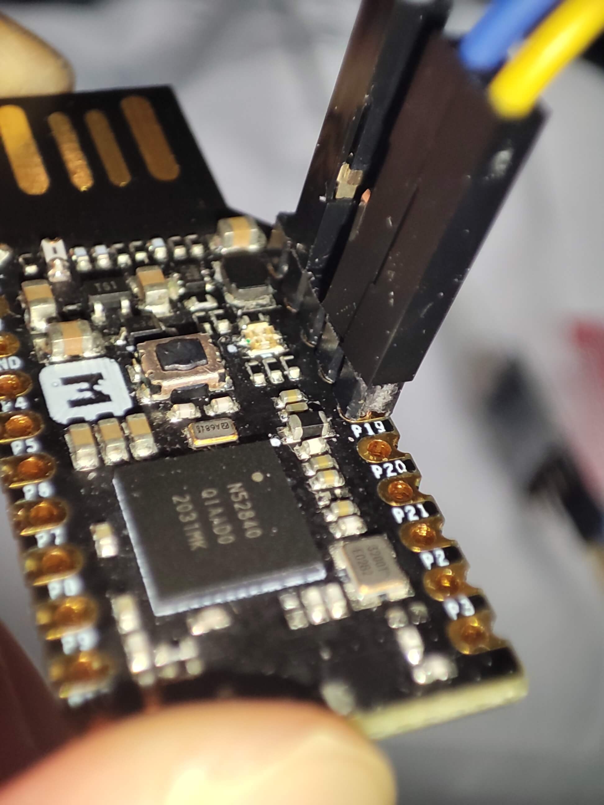

# 电烙铁
## 选择合适的电烙铁
+ 几十块钱的 DIY T12 （有的甚至支持PD供电），如果自制成本也不算高 ~~（但是制作烙铁需要你有个烙铁~~
+ 文宇WY815（这个是高频焊台）

## 焊接视频教程
+ [PACE基础焊接教程](https://www.bilibili.com/video/BV1at4y1k7EY)
> 其实它的另一个名字，是[NASA焊接基础](http://www.sal.wisc.edu/docs/Soldering%20Basics.pdf)

+ [手工焊接的七大恶习](https://www.bilibili.com/video/BV11Z4y1g7Lc)  
+ [手工焊锡基础教学](https://www.bilibili.com/video/BV1Dv411r7u5?p=1)
+ [NASA的焊接标准](https://workmanship.nasa.gov/lib/insp/2%20books/frameset.html)  (后来 NASA 转而采用 IPC 规范了)  

Youtube 上面也有很多高质量的焊接教程

## 免焊接工艺
焊接是良好固定和连接电子元件的最优解，但有些情况下并不适合焊接  
如果板子上有排针，除了常见的杜邦线外也可以选择很retro的绕线工艺，  
如果完全不想让板子沾锡（比如某些 usb dongle版）  
可以选择购置或自制测试针烧录夹  
可以选择直接用2.54mm排针插着，并不需要焊接  
  
例如图中就仅仅是把排针和杜邦线放在了板子上，没有进行任何的焊接，板子还是拿在手上的，既便如此，仍然完全能被 pyOCD 正常识别  
如果不识别怎么办？碰一碰排针，期待有魔法发生。  

## 关于无铅焊锡
+ 如果选择使用无铅焊锡，建议使用SAC305(SnAg3Cu0.5)组分焊料
> 含银是为了确保焊接强度（含铋或者只含铜强度会比较差），而不是什么导电性更好 ~~更 HiFi~~ 之类的  
> 见 NASA 关于无铅焊料的[文档](https://nepp.nasa.gov/files/10981/NASA%20Lead-Free%20Solder%20BOK%20Appendices%20May%202005%20(2).pdf)

## 焊接基础
电子焊接（软钎焊）是对电子元件进行可靠的连接和固定的方式，其原理是浸润作用  
焊锡是一种合金，对于有铅焊锡来说，其成分是锡和铅，对于无铅焊料来说通常是锡，银和铜，低熔点的焊锡则含有铋
不同成分，相同成分的不同比例会让焊锡具有不同的特性。      
Sn63Pb37的焊料是易融焊料，当达到熔点时焊锡立刻就变成了液态  
当焊锡融化时，热的助焊剂会清除电路板铜层的氧化膜，  
而浸润作用则使焊锡在铜层表面形成一种既不是铜和锡组成的新的合金，线路板因此而沾锡  
当焊料再一次冷却并凝固，元器件就可以被焊接

## 手工焊接的七大恶习：
+ 用力过大
+ 焊料热桥不合适
+ 错误的烙铁头尺寸
+ 过高的温度
+ 助焊剂使用不当
+ 转移焊接
+ 不必要的修饰或返工