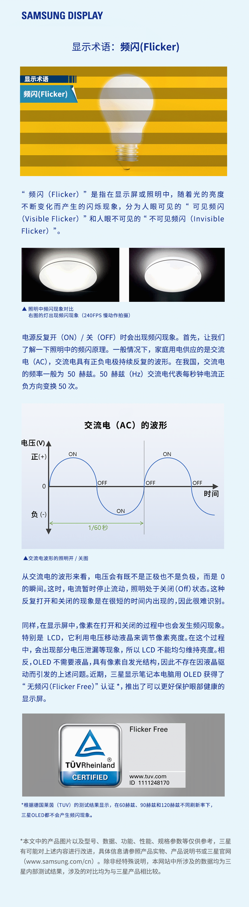

# 频闪的危害
> 本图片出自 SAMSUNG DISPLAY 官微于 2022 年 4 月 21 日 发布的 [微博](https://weibo.com/5849652227/Lpt21EtK3)
> 
> 由于三星是世界上出货量最大的 OLED 面板生产企业，我们用户**应当**相信三星显示的说法。（尽管这种说法对其普遍存在频闪的手机/平板面板产品线不利）

需要提醒的是，三星确实在『**较新型号**』的『**笔记本 OLED 面板**』上实现了全亮度 DC（包括但不限于小米笔记本，华硕无畏、无双等），但是，对于手机和平板，依然有深度较高且频率极低的低频频闪。取决于面板型号，出现频闪的亮度范围从20%亮度以下到全亮度不等。部分国产厂商也有通过软件算法实现了低亮度下的类 DC 调光，部分第三方 ROM，也提供了类似的功能，但三星自己的手机/平板用的面板，除了 PSV 这种由于面板工艺较早没有频闪以外，之后采用 AMOLED 的此类产品从未上线这一功能（截至 2022 年 4 月）。

尽管不同人群的体质差异导致对频闪的敏感程度不同，有些人根本感受不到，但厂商显然有义务消除其产品的潜在安全风险。

> 三星电子的手机/平板有频闪关我三星显示什么事.jpg

关于频闪测试，可参考 Notebookcheck

